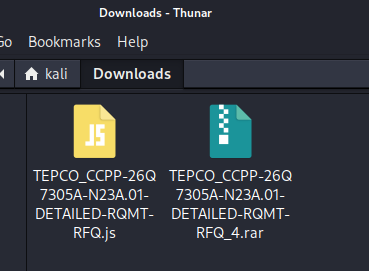
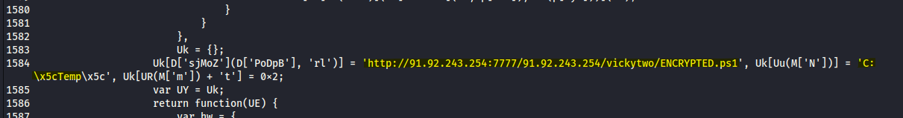
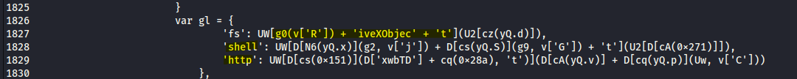
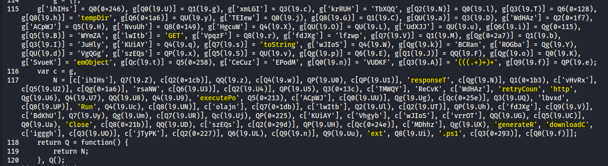
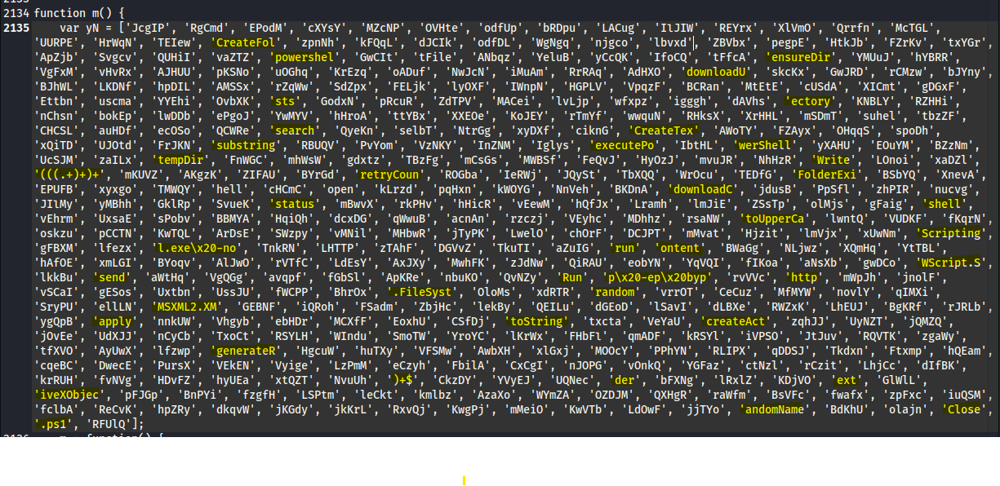
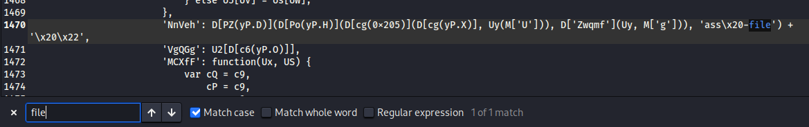
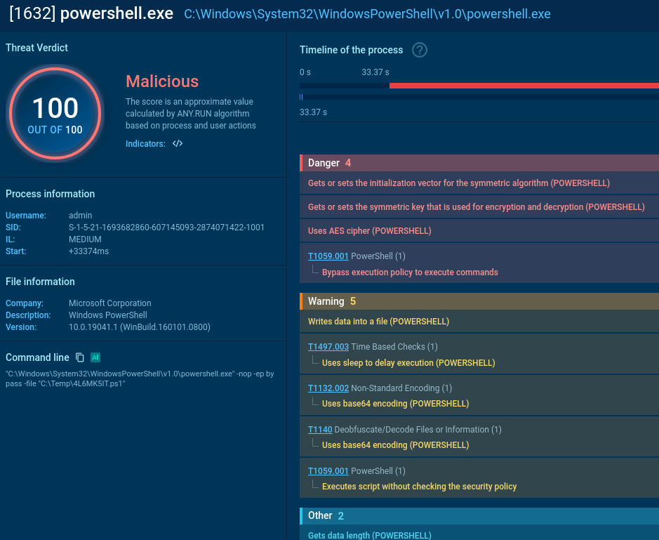

# TEPCO Phishing - 20260315

Today I have a file that was found as part of a phishing scam, impersonating TEPCO. The threat actors used social engineering by creating fake "toshiba-co.jp" emails to send a download link to files.fm where the malicious file was hosted. Your average phishing attempt. And now that I've got my hands on it, lets check it out!

After extracting the RAR folder, it's contents revealed a suspicious .js file. 

Yikes, that's ugly. Lets put it through a js-beautifier like beautifier.io to get it cleaned up.

Briefly scanning through the now 2,100+ lines of obfuscated code, a lot of it appears to be string array functions plus one very long execution function in the middle. Which means it's just going to keep looking up array indexes, return a string, and build some sort of command. 
And I really don't wanna waste time digging through it all, so let's look for a few readable keywords.

ActiveXObject already tells us we aren't dealing with browser JavaScript. This is JScript designed to run on Windows just by double clicking.

Huh. Looks like we got an IP address that invokes a remote script. Interesting they didn't bother to hide this. Looks like it's being saved to the Temp folder. 
http[:]//91.92.243.254:7777/91.92.243.254/vickytwo/ENCRYPTED[.]ps1

Here we can see a "shell" and "http", and above that looks like a string concatenation to create ActiveXObject.

Here's a powershell being executed.

And as we can see in these two string arrays, there a bunch of half-written commands mixed in with filler strings. I've highlighted all that I could find in the paragraph. But even with these being incomplete, I think we can slowly piece together what this code is trying to accomplish.

Let's try piecing together a powershell command from the highlighted readable strings. 
'powershel' + 'l.exe\%20-no' + 'p\%20-ep\%20byp' = **powershell.exe -nop -ep byp**

We're missing the last part which should help create the word "bypass". A quick lookup through the code though will soon reveal the missing part.

BINGO! 
**powershell.exe -nop -ep bypass -file** 
So now we have proof that an execution policy bypass is being envoked! 
And something else is being concatenated after it too, \x20\x22. Is that a filepath....?

But lets be honest, picking all this apart doesn't really get us to the meat and potatoes, does it? 
Unfortunally this is as far as this code seems to go though. 
But there's a good chance that whatever ENCRYPTED.ps1 is, once it's downloaded and envoked, something gets dropped in the Temp folder, then that gets executed through the powershell script we just created.

To see what happens after the script is executed, let's run this on AnyRun. 
As of writing this report, the server hosting the file is currently down. But luckily someone else uploaded the same file while it was still active. I will be referring to this sandbox link from here on out: 
https://app.any.run/tasks/d75c093a-dff4-4652-9a31-490c649a1003

There's a few areas that were detected but lets focus on this area for now. 
It gets flagged right off the bat in WinRaR, but once it's executed, we see it run a wscript. We did see a WScript in our string array. 
After that we have our powershell script! The same one we put together except with a filepath and filename. And it is indeed inside the Temp folder. 
After that we have an aspnet_compiler.exe. We'll dig into that later. 
Then another wscript.exe and another powershell script that's executing a different file that before. This is looking to be a multi-stage dropper chain.

Now let's open up that aspnet file and see what's happening inside.

So an aspnet compiler for web apps on PC. It's considered an LOLBin (Livng of the Land), used by threat actors because it's a signed Microsoft.NET framework and can go undetected. This compiler is probably also what actually builds the malicious code, and does it under a native process to avoid detection.

Just by a glance at the results of this though, it appears to be stealing data from files and web browsers. What's also interesting in the Warning section, it mentions "possible usage of Discord/Telegram API detected". Perhaps those apps are being used as the C2 server.

Lets focus on the two wscripts now.

First, taking a look at that command line: 
C:\Windows\System32\WScript.exe" "C:\Users\admin\AppData\Local\Temp\Rar$DIa10032.37332\TEPCO_CCPP-26Q7305A-N23A.01-DETAILED-RQMT-RFQ.js 
We can guess what the original ENCRYPTED.ps1 script was doing now. It created the new folder Rar$DIa10032.37332 inside the Temp folder, then created another TEPCO .js file with the same name as the original. Perhaps keeping the file name the same as the downloaded one is to make it appear to be the same thing, but we can bet the script for this one is much different. When this file runs, it sends out an HTTP request to what we can assume to download the file H41MOD92.ps1 into the Temp folder. 
Powershell then executes H41MOD92.ps1. 
This is the script I suspect runs the aspnet_compiler.exe. "Dynamically loads an assembly."

The second wscript.exe is similar to the first. 
Except the command line reveals a new folder inside Temp: Rar$DIa10032.38073. Since there are no other signs of a folder being created again, it's possible both these folders and their .js files were created at the time ENCRYPTED.ps1 was executed. Which also means the scripts on both of these are different.  
When this file runs, it again sends out an HTTP request and then executes the powershell script 4L6MK5IT.ps1 from the Temp folder. Clicking into the powershell.exe tab, this appears to be encoding data.

At the end of that last powershell command though, there's a conhost.exe error code. It's possible that whatever script was supposed to be executed ended up failing, and the data that was encrypted never made it back to the C2 server.

So here's a visual of the chain of events: 
TEPCO .js file 
    └── downloads & executes ENCRYPTED.ps1 
            └── creates folders Rar$DIa10032.37332 & Rar$DIa10032.38073 into %TEMP% 
                    └── executes Rar$DIa10032.37332 TEPCO.js file 
                        └── executes H41MOD92.ps1 
                                └── error
                                └── invokes aspenet_complier 
                                        └── compiles payload 
                        └── executes Rar$DIa10032.38073 TEPCO.js file 
                           └── executes 4L6MK5IT.ps1 
                                 └── error

Since the aspenet_complier was flagged as a Snake YARA, lets see what kind of malware that usually is.

According to Australia's cyber.gov.au: 
A "Snake YARA" rule is a security detection signature used to identify Snake malware, a highly sophisticated cyber espionage tool developed by Russia's Federal Security Service (FSB). These YARA rules are designed to detect file patterns and memory signatures of the malware, which has been used for over two decades to steal intelligence from government networks and critical infrastructure worldwide.

Well.... that's kinda cool.