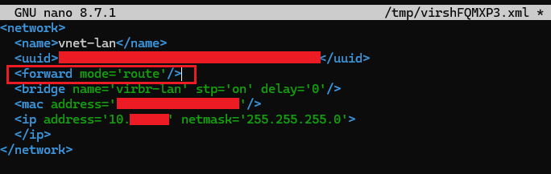
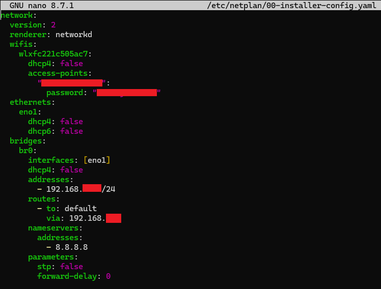
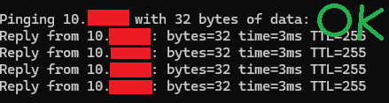
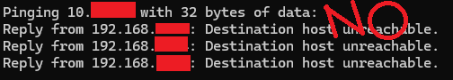

# WAN to VLAN GUI setup - 20260602

Before we can move forward, I mentioned briefy in the initial setup, we want to remove https access from our WAN (port1). If we configure that while still logged into the GUI on the WAN ip address, we won't be able to log back in. So from here on out, we want to log in to our GUI from our LAN ip address.

Note: If you don't care about security and don't mind having GUI admin access from the internet (home labs are probably okay, but for real deployment no), then you can skip this part. Just remember to allow/keep HTTPS access on port1.

## Routing to home server VLAN

This took me hours of troubleshooting, and every correct step I took in the proccess was not linear at all. Something would work then something would break, and so on.<br>
But I tried the best I could to organize what seemed to have worked and what the issues were.<br>
I did solve it though!<br>
If these same solutions don't work for you, you may need to troubleshoot on your own. But I hope at the very least it gives you a rough idea how how to approach the problem and what you should probably be configuring.

### UFW (host firewall) configuration

Let's start with our firewall.<br>
If you have already set up UFW on your server, there's probably going to be some conflict with your configuration.

Check your current configuration with `sudo iptables -L FORWARD -n -v`.<br>
If you see `Chain FORWARD (policy DROP)` and under LIBVIRT `ufw-reject-forward all`, this mean that all forwarding is auto blocked unless it is explicitly stated.<br>
Let's fix this.

First allow UFW to forward traffic:<br>
`sudo nano /etc/ufw/sysctl.conf`<br>
Look for `#net/ipv4/ip_forward=1` and uncomment it out (delete the #). Then save and exit.<br>
Next edit the default config:<br>
`sudo nano /etc/default/ufw`<br>
Look for `DEFAULT_FORWARD_POLICY="DROP"` and change "DROP" to "ACCEPT". Save and exit.<br>
Then allow traffic between br0 and virbr-lan in UFW:<br>
```
sudo ufw route allow in on br0 out on virbr-lan
sudo ufw route allow in on virbr-lan out on br0
```
And reload the UFW. `sudo ufw reload`

### Libvirt (VM management tool) configuration

Now is the issue with libvirt. This issue is related to a security feature built into libvirt that keeps virtual networks isolated by design. It's designed to only allow traffic between vms on the same network (aka virbr-lan virbr-lan). Great normally, but not for what we need to do.<br>
How to fix this, we need to edit the libvirt network definition to allow forwarding. We'll set the network "forward mode" from isolated to route.<br>
`virsh net-edit vnet-lan` and choose the first editor.<br>

Then add `<forward mode='route'/>`.<br>


Now to restart the libnetwork to apply changes.<br>
```
virsh net-destroy vnet-lan
virsh net-start vnet-lan
```
Then check if vnet1 is listed here `bridge link show`.<br>
If it's missing, do `sudo ip link set vnet1 master virbr-lan`to reconnect it.<br>
Then check `virsh domiflist fortigate` to make sure it persists on reboot. If vnet1 lists "network" as the Type and "vnet-lan" as Source, then you're all set.

### Netplan configuration

There's two things I had to change here. One of them was very specific to my setup.<br>
1. Wifi ip address was conflicting with bridge traffic.<br>
2. My bridge needed to be routed.

1. I still had issues pinging my Fortigate LAN ip, and it appeared to be due to asymmetric routing. Traffic coming in one way and replies out the other. My wifi and bridge were on the same route. To fix this I removed the static ip from my netplan. If you run into a similar issue of getting "Request timed out" when you try to ping the Fortiget LAN, try deleting your wifi's "addresses", "routes", and "nameservers" from the netplan. If you never set up a wifi netplan like I did during the initial setup to begin with, you shouldn't have an issue. Which means now I ssh using ethernet (eno1 ip) instead of wifi.

2. Then I had to add the default route back `sudo ip route add default via 192.168.x.x dev br0`, and edit the netplan again to make it permanent, basically like how my original wifi was set up. Note that the above sudo ip and the below route ip is the same (our default gateway). The "addresses" ip is your home server ip.<br>


### Disable port2 RPF (reverse path forwarding)

Now let's disable port2 RPF in the Fortigate console.<br>
The issue: This is a security feature in Fortigate that when a packet arrives it checks wether it should send it back on the same interface it arrived on.<br>
Our packet arrived on port2 from our PC's ip, but Fortigate's routing table says to reach that ip, user port1. The interfaces don't match and so Fortigate conclides that the packet must be spoofed and drops it.<br>
This can be solved by changing the routing table, but if that's the case your PC has to have a static ip. It won't work if it uses DHCP.<br>
This does sound like a security issue since ip spoofing is a thing, but port2 is our internal LAN. The only devices that can send packets to port2 are the vms we control on virbr-lan. But absolutely we want to keep the RPF protection on port1 (WAN).

I don't want to change my DHCP settings, so I'm going to just disable this feature.<br>
Enter the console from the command line with `sudo virsh console fortigate`, log in and paste the following.<br>
```
config system interface
    edit port2
        set src-check disable
    next
end
```

### IP-forwarding

Next we need to tell the KVM host (our hypervisor) to enable IP forwarding so it will pass traffic between our home network (our PC is on this) and virbr-lan. This requires making a seperate sysctl config file to enable IP forwarding permanently.<br>
```
echo "net.ipv4.ip_forward=1" | sudo tee /etc/sysctl.d/99-ipforward.conf
sudo sysctl -p /etc/sysctl.d/99-ipforward.conf
```

### Routing configuration

After that, we need to add a static route on our PC. This will tell our PC that in order to reach our VLAN network, we need to go via the KVM host.<br>
On our PC, go to the command prompt as administrator and add the below for Windows (MAC is different):<br>
`route add 10.x.x.x mask 255.255.255.0 192.168.x.x -p`<br>
→ -p makes it permanent across reboots
→ The last ip in the command is your static KVM host ip.

Once you do that, try accessing the GUI via the VLAN ip.<br>
`https://10.x.x.x/login`

Note: It might take some time to load after bypassing the security warning to get to the login page. Like a really long time. I'm not sure what the issue is with this, possibly due to routing. Just leave the page open to load (even if it says it can't reach a connection) and it will eventually find its way. So long as you're still able to successfully ping to the server.

Note: If you are still not getting a connection to the GUI, try pinging your VLAN ip from your PC. The response it gives should help you determine if it's firewall policy related or port forwarding related trouble. If the ping is replying from your PC ip, that's probably related to a routing issue on your PC. Try adding the route again.<br>
Refer to the images below for a good and bad ping. You'll notice that the good ping replies to the same ip, while the bad ping is replying to the PC ip.





And now we've got access to the GUI via our VLAN ip!<br>
Our admin access is safe from internet exposure!


