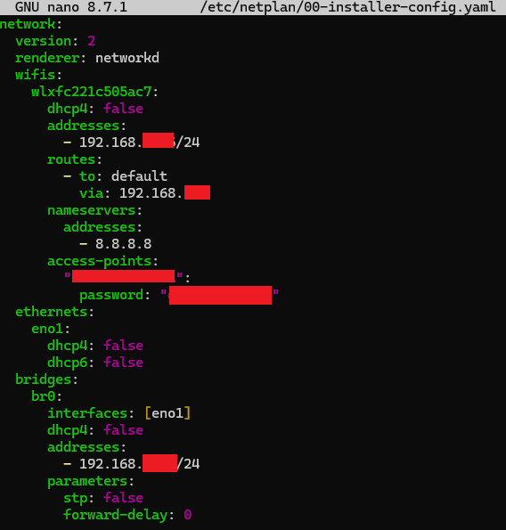
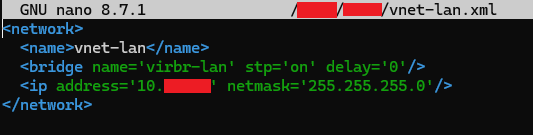
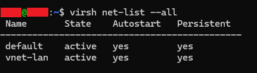
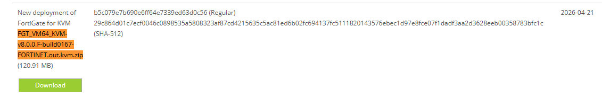
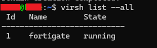
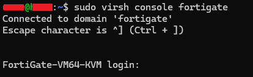
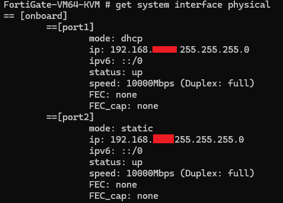
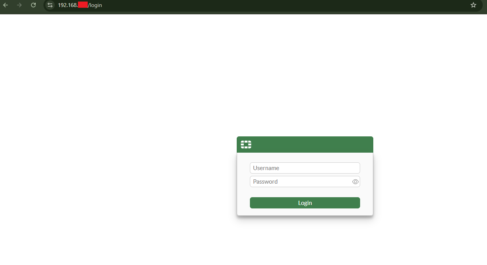
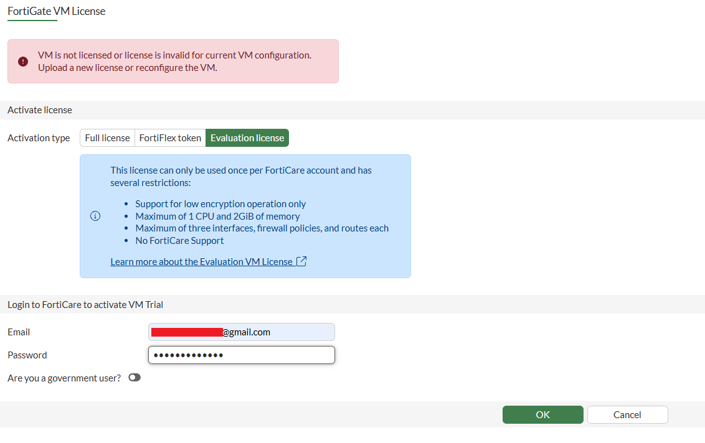
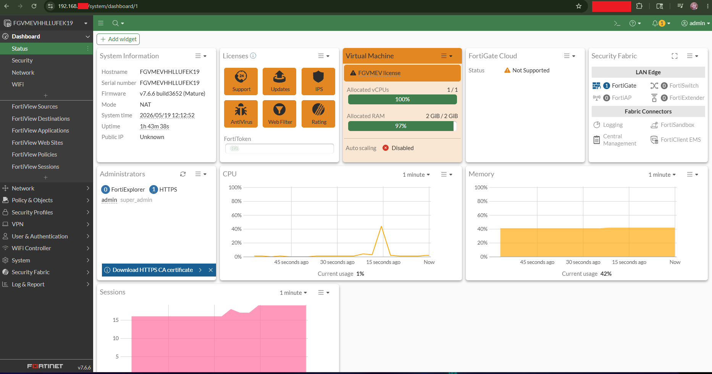

# FortigateVMインストール手順 - 20260520

### AIで翻訳されています。

## ミニPCにWiFiを設定してLANブリッジを追加する

ホームサーバーシリーズの第一弾として、まずサーバーとして使えるマシンを用意する必要があった。<br>
予算の都合上、中古のHP ProDesk ミニPCを選んだ。スペックはIntel i5、メモリ8GB、ストレージ256GB。<br>
執筆時点でのサーバーの用途はこんな感じ：<br>
→ Webサーバーの構築<br>
→ ModsecurityとNginxを使ったWAFの構築<br>
→ WebページとDockerコンテナのホスティング<br>
→ QRadarに転送するログコレクターの構築<br>
→ Fortigate VMでネットワークセキュリティを管理

数日前にUbuntu Serverをインストールして、WiFiと静的IPの設定まで完了させた。

静的IPを設定するには、etcフォルダにあるnetplanファイルを編集する必要がある。<br>
`sudo nano /etc/netplan/00-installer-config.yaml`<br>



「renderer」以降を全部消して、WiFiの設定を追加した。「wifis」の下はミニPCに付属のWiFi USBデバイス名。dhcp4はfalseにして、サーバーが再起動するたびに新しいIPを取得しないようにしている。addressesには自分で決めたローカルIPアドレスとサブネット（192.168.x.x/24）を入力。<br>
その下の「routes」はdefaultに設定して、「via」にはメインPCから確認したゲートウェイIPを入れる。<br>
「nameservers」はGoogleのDNS。<br>
最後に「access-points」がWiFiルーターの設定で、上にルーター名、下にパスワードを入れる。

WiFiの下にはイーサネットの設定も追加した。こっちの静的IPはWiFiとは別のものにする。追加した設定の説明：<br>
→ eno1はイーサネットのデバイス名。自分の環境では`ip a`で確認できる。IPは設定しない（生のケーブルポートとして扱う）、ブリッジ側にIPを持たせるため。<br>
→ br0がケーブルポートを所有するブリッジで、ここに静的IPを割り当てる。<br>
→ stp: falseとforward-delay: 0はトラフィック転送前の待機時間をなくすための設定。STPプロトコルは大規模ネットワークでのループ防止用なので、ここでは不要。

書き終わったら、新しい設定を適用する `sudo netplan apply`.<br>
設定を間違えて書き直す場合、古いDHCPをクリアしないと新しい設定が反映されないことがある。<br>
その場合は`sudo ip addr flush dev <WiFiカード/USBデバイス名>`を実行してから再度applyすればOK。<br>
これでサーバーにSSH接続できるようになる。

※: WiFiを初めて接続する際は、WiFi USBデバイスのドライバーが先にインストールされていることを確認すること。じゃないとサーバーにインターネット接続がない状態になる。

さて、それが終わったらいよいよFortigate VMのインストールに入ろう。<br>
Fortigate VMについて簡単に説明すると、無料で使えるFortigateファイアウォールだが、機能はかなり制限されている。とはいえ、ホームラボ用としては十分すぎるくらい。

## 仮想LANネットワークの作成 -- ブリッジモード

Fortigate VMのインストールを始めるにあたって、まずVMエンジンを用意する。今回はUbuntu向けのQEMUを使う。合わせてKVM管理レイヤーと、GUIなしのサーバーでVMをコマンドラインから作成するためのツールもインストールする。<br>
`sudo apt install -y qemu-system-x86 libvirt-daemon-system libvirt-clients virtinst`<br>
→ qemuがVMエンジン本体。<br>
→ libvirtが管理レイヤー。<br>
→ virtinstがCLIからVM操作するためのツール。<br>
システム再起動時に自動起動するよう、libvirtdを有効化しておく。<br>
`sudo systemctl enable --now libvirtd`

現在のユーザーはrootじゃないので、libvirtグループに追加してsudoを毎回打たなくて済むようにする。<br>
```
sudo usermod -aG libvirt,kvm $USER
newgrp libvirt
```
現在作成されているVMの一覧を確認：<br>
`virsh list --all`<br>
今はまだ何もないはず。<br>

まずLANケーブルをサーバーとルーターの間に繋いでおくこと（ブリッジモードで動かすため）。それから仮想LANを作成する。LANにはインターネット接続は通さず、ブリッジによって物理イーサネットポートをVMに直接繋げる。これによりFortigateのWANポートがルーターに物理的に直結されているように見える。NATだとサーバー側でトラフィックを一度受け取って変換してからFortigateに渡す形になるのでNG。NATでもGUIにアクセスする方法はあるが、このやり方の方がずっとシンプルで安定している。

LAN用の設定ファイルを作成する。<br>
`nano ~/vnet-lan.xml`<br>
<br>
→ vnet-lanがネットワーク名。<br>
→ virbr-lanが仮想スイッチ名。<br>
→ IPアドレスは内部ネットワーク上のUbuntuのアドレス。好きなものを設定できる。

次に以下のコマンドでネットワークを登録・起動する：<br>
```
virsh net-define ~/vnet-lan.xml
virsh net-start vnet-lan
virsh net-autostart vnet-lan
```

`virsh net-list --all`で確認してactiveになっていればOK。<br>



## Fortigate VMパッケージの取得

Fortigateを使うにはアカウントが必要。<br>
無料ルートで行く場合、将来的なテスト時にいくつか※意点がある。<br>
・ トライアル版を選んだ場合、Fortigate VMトライアルは全機能が30日間無料で解放される。その後もVMは起動・動作するが、ライセンスなし状態で機能が大幅に制限される。<br>
・ Fortiサーバーから自動更新されるライブ脅威インテリジェンスフィードも停止する。セキュリティを継続して維持したい場合は、公開されている無料のブロックリストから脅威インテリジェンスファイルを手動でインポートする必要がある。

※: このチュートリアルではトライアル版は使わないので、無料ティアに合わせた設定で進める。

サイトでの手順：<br>
→ support.fortinet.comでアカウントを作成。<br>
→ `https://support.fortinet.com/Download/VMImages.aspx`にアクセス。<br>
→ 左側でKVMをプラットフォームとして選択。<br>
→ `FGT_VM64_KVM-v8.0.0.F-build0167-FORTINET.out.kvm.zip`をダウンロード。<br>
FGTが今回のプロダクト、ハードウェアはx86-64、ハイパーバイザーはKVM、.kvm.zipには必要なqcow2ディスクイメージが入っている。<br>
ダウンロードするバージョンはリリース状況によって異なる。<br>


別のコマンドプロンプトを開き、scpでサーバーにファイルを転送する。scpはSSH経由の安全なファイル転送。<br>
`scp C:\Users\<username>\Downloads\FGT_VM64_KVM-v8.0.0.F-build0167-FORTINET.out.kvm.zip <server-username>@<server-ip>:~/`

サーバー側でzipを解凍する。<br>
unzipが入っていなければ先にインストール：`sudo apt install -y unzip`<br>
```
cd ~
unzip FGT_VM64_KVM-v8.0.0.F-build0167-FORTINET.out.kvm.zip
ls
```

## Fortigate VMのデプロイ

ファイルがサーバーに揃ったので、いよいよVMに繋げていく。<br>
VM作成の手順：<br>
まず解凍した.qcow2ファイルをlibvirtのimagesフォルダにコピーする（ファイル名をfortiosからfortigateに変更）。<br>
`sudo cp fortios.qcow2 /var/lib/libvirt/images/fortigate.qcow2`<br>
```
sudo virt-install \
  --name fortigate \
  --ram 2048 \
  --vcpus 1 \
  --os-variant generic \
  --disk path=/var/lib/libvirt/images/fortigate.qcow2,format=qcow2,bus=virtio \
  --network bridge=br0,model=virtio \
  --network network=vnet-lan,model=virtio \
  --import \
  --noautoconsole
```
→ name、RAM割り当て、vcpuはそのまま。CPUやメモリをもっと増やすこともできるが、無料ティアの制限内に収めるためこれがベスト。<br>
→ disk pathは先ほどコピーした仮想ハードドライブ。<br>
→ network bridgeはFortigateの1番ポート（WAN側）を直接繋ぐ設定。FortigateはルーターのDHCPから他のデバイスと同様にIPを取得する。<br>
→ network networkはFortigateの2番ポートを隔離されたネットワークに繋ぐ（LAN側）。<br>
→ importは既存のディスクイメージを使う指定。<br>
→ noautoconsoleはコンソールウィンドウの自動起動を防ぐ。どうせ見えないので（ヘッドレス環境）。

先ほどのコマンド`virsh list --all`でVM一覧を確認すると、Fortigateが表示されているはず。<br>


Fortigateのコンソールに接続する。<br>
`sudo virsh console fortigate`

※: サーバーをシャットダウンすると、Fortigate VMは再起動時に自動起動しない（他のVMとは違い）。自動起動の設定もできるが、そこまで重要じゃないので（コンソールアクセス用に過ぎないため）、毎回手動で起動することにする。`sudo virsh start fortigate`を実行してから上のコマンドを叩けばOK。

接続したら、Fortigateのターミナルに直接入力できる状態になる。<br>
Enterを何度か押してログインプロンプトを表示させる。<br>


ユーザー名はadminで、Enterを押すと新しいパスワードの作成を求められる。<br>
ちなみにFortigate VMから抜けてサーバーに戻るには`Ctrl ]`。

次に、Fortigate LANポートに静的IPを設定する。<br>
```
config system interface
  edit port2
    set mode static
    set ip 192.168.x.x 255.255.255.0
    set allowaccess https ssh ping
  next
end
```
→ port2がLAN側、port1がWAN側（インターネットに向いているvnet-wan）。管理はセキュリティ上LAN側で行う。インターネットに管理画面を晒したくないので。<br>
→ LANのサブネットはWANと被らないようにすること。第3オクテットを変えるか、10.x.x.xや172.x.x.xのアドレスを使うといい。

次に、port1（WAN側）がルーターからIPを取得できているか確認する。
`get system interface physical`<br>


ルーターのDHCPから割り当てられた192.168.x.xのIPが表示されるはず。表示されない場合は以下のコマンドで強制的に取得できる：<br>
```
config system interface
  edit port1
    set mode dhcp
  next
end
```

ブリッジの設定が完了したので、メインPCのブラウザからFortigate GUIにアクセスできるはず。`get system interface physical`で表示されたport1のIPアドレスを使って、ブラウザで`https://192.168.x.x/login`を開いてみよう。（後で静的IPに変更するが、まず動作確認を先にする。）<br>
「安全でないページ」の警告が出るが、それは正常なので無視して進めるとFortigate GUIのログインページが表示される。<br>



次にEvaluation（評価用）ライセンスを取得する。Activation typeとして「Evaluation licence」を選択。<br>
制限事項が表示されるが、それが先ほどVM設定を調整した理由でもある。<br>
Fortigateアカウントのメールアドレスとパスワードを入力するとシステムが再起動する。<br>
動くか確認してみよう！

※: Fortigate VMは1アカウントにつきEvaluationライセンスは1つまで。もし既にライセンスが有効になっている場合は、先にアカウントから削除する必要がある。後でVMを削除して再インストールする際にも重要なので覚えておくこと。



ダッシュボードが表示された！

※: ダッシュボードにログインしたのに数秒後にログインページにリダイレクトされる場合、これは自分も最初に遭遇したバグ。v7.6.6にダウングレードすることで回避できる。同じダウンロードページの左側でバージョンを変更してダウンロード可能。（自分もかなり試行錯誤した結果、v7.6.6を使うことにした。）

さて、WANの静的IP設定をしよう。port1のIPは好きなものを選んでOK。DHCPで最初に割り当てられたものをそのまま使っても構わない。<br>
```
config system interface
  edit port1
    set mode static
    set ip 192.168.x.x 255.255.255.0
    set allowaccess ping https
  next
end
```
→ httpsを許可しないとGUIにアクセスできなくなるので※意。<br>
※: セキュリティ上の理由から、この設定は推奨されません。管理者アクセスをWAN側に公開するべきではありません。ただし、現時点ではGUIへアクセスするための一時的な措置として利用します。次のチュートリアルでパブリックIPアドレスを設定した後、HTTPSアクセスは削除します。<br>
→ pingはトラブルシューティング用。

最後にデフォルトゲートウェイも設定して、Fortigateがインターネットに繋がるようにする。<br>
```
config router static
  edit 1
    set gateway 192.168.0.1
    set device port1
  next
end
```

以上で完了！<br>
これでFortigateがサーバー上で動くようになったので、色々と設定を触り始められる。