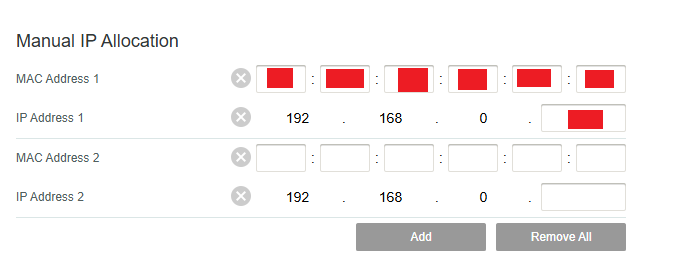
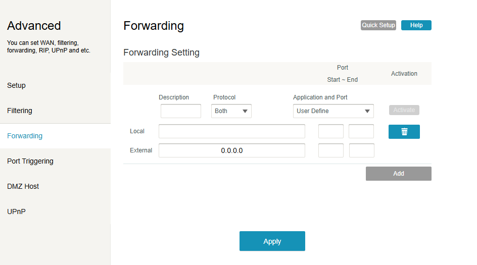

# IPSec VPN ポートフォワーディング - 20260618
### AI翻訳です。

IPSec VPN関連の作業を始める前に、まずルーターでポートフォワーディングを有効にしておく必要がある。これはこのセクションを進めるための前提条件だ。<br>
サイト間IPSecでは、どちらか一方のエンドがポートを開放してACK-SYNで接続を受け付けられる状態にしなければならない。自分の場合、職場・オフィス環境から接続することが目的なので、自宅ルーターのポートを開けておく必要がある。

ルーターの設定は機種によって異なるが、自分の手順を例として紹介していく。<br>
まず初心者向けに、そもそもなぜポートフォワーディングが必要なのかを説明しよう。<br>
IPSecのトラフィックがパブリックIPに届いた時、ルーターはそれを受信するものの、どこに送ればいいかわからず破棄してしまう。ポートフォワーディングを設定することで、例えばUDP 500のトラフィックが来たらFortigateに転送しろ、とルーターに指示できるわけだ。

ではFortigate側の準備から始めよう。コンソールにログイン `sudo virsh console fortigate` して、`show system interface port1` でIPアドレス（もう把握してるはずだけど）と、`diagnose hardware deviceinfo nic port1` でMACアドレスを確認する。<br>
MACアドレスは「Permanent Hwaddr」として表示される。<br>
IPアドレスとMACアドレスは後で使うのでどこかにメモしておくこと。

次に自宅ルーターの管理画面にログインする。アドレスは通常 `<ゲートウェイIP>/login` だ。ログインIDとパスワードはたいてい「admin」と「password」だが、不明な場合はルーター本体にログイン情報が書いたシールが貼ってあるはず。

次はFortigateに固定IPを予約する。<br>
設定のどこかに「DHCP Reservations」や似たような項目があるはずだ。自分のルーターでの見た目を画像で載せておく。MACアドレスとIPを入力する欄があるので、さっきメモした内容を入力して保存する。ルーターが再起動されるので、これでFortigateのport1に固定IPが割り当てられた状態になる。<br>


次はポートフォワーディングのルールを作成する。<br>
このラボではUDP 500とUDP 4500を開放する。それぞれの理由を説明しよう。<br>
→ UDP 500：IPSecの初回ハンドシェイク、つまりIKE（Internet Key Exchange）で使用するポート。このチュートリアルのパート2で詳しく解説するが、ここでは両方のFortigateが暗号化と認証についてネゴシエーションするためのポートだと思っておけばいい。<br>
→ UDP 4500：NATトラバーサル用のポート。FortigateはルーターのNAT配下に置かれているため、IPSecのトラフィックがNATを通過できるようにUDP 4500でラップする必要がある。<br>
通常のエンタープライズ環境ではFortigateをルーターの前に置くのが一般的だが、自分はFortigateを自宅サーバー専用にしたい（他のデバイスには触れさせたくない）ので、ルーターの外には出さなくていい。

ルーターの管理画面に戻ろう。<br>
ポートフォワーディングに関連する設定を探す。自分の環境では以下のような画面になっている。<br>

→ Port Start〜End：転送するポート番号。今回は単一ポートなので開始と終了は同じ番号にする。<br>
→ Protocol：UDPまたはTCP。IPSecはUDPを使用する。<br>
→ Local：内部ネットワーク上の転送先IP、つまりFortigateのport1のIPアドレス。<br>
→ External：このままでOK。「外部のどのIPからでも」という意味だ。

1つ目のルール、IPSec IKEを作成しよう。<br>
```
Description: IPSec-IKE
Protocol: UDP
Port Start: 500（ローカル・外部ともに）
Port End: 500（ローカル・外部ともに）
Local: <FortigateのPort1 IP>
External: 0.0.0.0
```
ActivateをクリックしてApplyを押す。

2つ目のルール、IPSec NAT-T。<br>
```
Description: IPSec-NAT-T
Protocol: UDP
Port Start: 4500（ローカル・外部ともに）
Port End: 4500（ローカル・外部ともに）
Local: <FortigateのPort1 IP>
External: 0.0.0.0
```

以上だ。これで次のチュートリアル `2.1_JP_IPSecVPNサイトtoサイト.md` と `2.2_JP_IPSecVPNリモート.md` に進む準備が整った！