# Site-to-Site IPSec VPN - 20260618

The goal of this is project is to get my home server connected to the Fortigate test device located at my workplace. I figured it was a good oppertunity to try to take advantage of the test device that my workplace has. To test if it works, I'm going to try sending this write up over the VPN once it's all set up. Proof that it's working and all. (Spoiler, I did!)

So what's the deal with IPSec anyway, and why do we want it? 
TCP/IP protocols don't have any security features, so this is what adds security when tranferring data. But basically, thanks to all the security features involved (which we'll take note of some as we reach them), it makes for a pretty secure way to send traffic. One of the better types of VPNs out there.

IPSec has two different modes, "End-to-End" and "Site-to-Site". 
The technical difference between them is that Site-to-Site (tunnel mode) encapsulates both the original IP header and payload, in addition to adding on an additional IP header (a public IP), while End-to-End (transport mode) only secures the payload. The original IP address is visible in the header. 
But in simple terms, Site-to-Site connects two distinct and permanent networks, eg. branch office to HQ. 
End-to-End is what we know as "remote access", where you connect a user device to a network. And when configuring that in Fortigate it's called Dialup VPN. 
This tutorial is just connecting via Site-to-Site. For remote access, refer to `2.2_IPSecVPN-DialupVPN.md`.

Before getting started, you'll need to configure at least one of your routers for IPSec port-forwarding. You can refer to my `2.0_IPSecVPN-Port-Forwarding.md` manual on how to do that.

Also, we'll need the WAN IP for both of our devices. If you're unsure, you can find your Fortigate's IP from the System Information widget under Status on the dashboard. 
If your WAN IP says "Unknown", you can check what your ip is from `whatismyip.com`. 

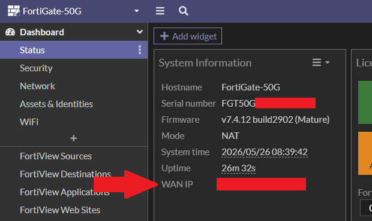

## Create New VPN Tunnel

Cool. Now let's get into configuring IPSec on Fortigate. 
Be aware that depending on your version of Fortigate, the UI will appear differently. But the steps and instructions are the same.

Once you've logged into your Fortigate GUI, go to VPN > VPN Tunnels and click Create new > Custom IPsec tunnel.

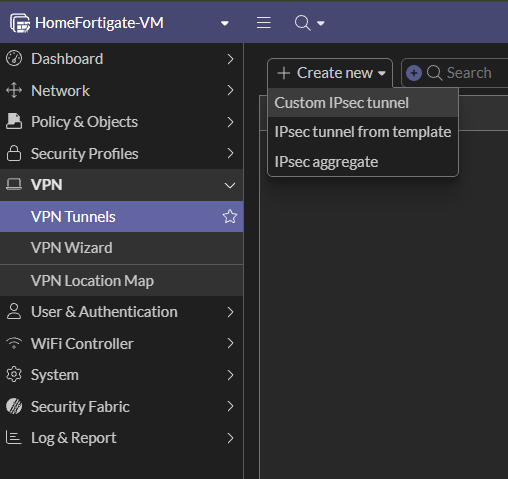

[Different UI]

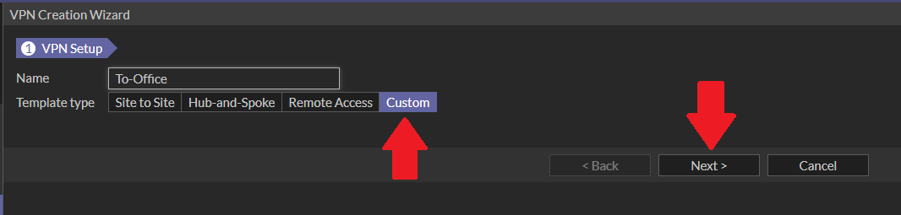

Give it a name, fill in the ip address. Then for Interface, select "port1".

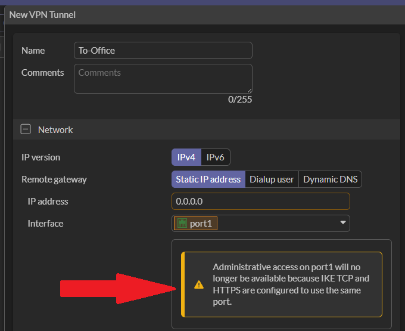

But... now we have an error. If we assign port1 here we will lose admin access to the GUI. IKE TCP and HTTPS can't be configured to use the same port. So.... we have two options. 
1. Accept we'll lose access and use port2 to login to the GUI. 
2. Change the admin access port from 443 to something else.

I am going to choose option 2. Why? Because I already went through the pain of option 1 and I didn't like the instability of the connection. 
To go into a little more detail here, what's happening is that packet inspection policies for can't distinguish IKE TCP traffic (which uses port 443) from HTTPS admin traffic. Basically it's warning that if the traffic on this port is supposed to route to the admin GUI, it might get mistaken for other IKE traffic and not work.

Go to System > Settings and change the HTTPS port to something other than 443. 8443 is a common port for this. After applying the change, you'll be signed out and have to log back in. When that happens, you'll now log back in through the link `https://<fortigate-ip>:<new-https-port-number>` for example: 192.168.0.32:8443.

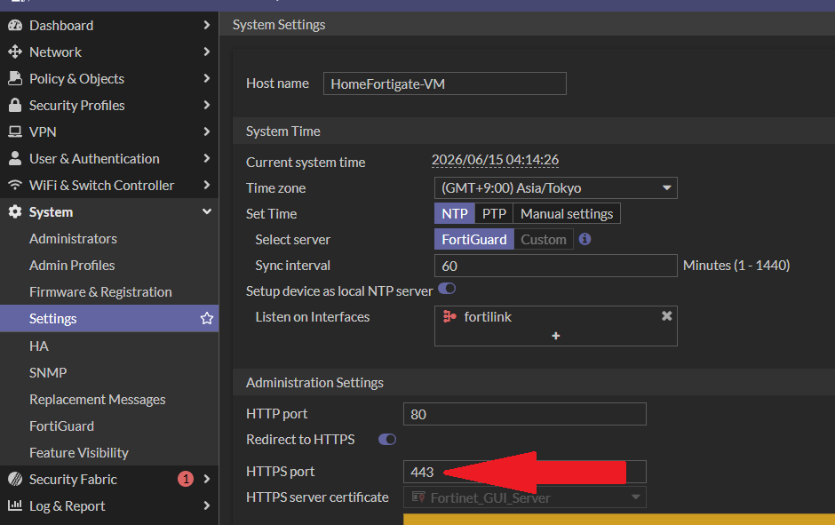

Back to our VPN tunnel. 
The previous admin access warning should now be gone.

Great, now let's add a name for the server we're connecting to. 
Underneath that you'll notice there's already a template type that says Site to Site, but we want to choose "Custom" instead. Then Next. 
The screen should look something like this now.

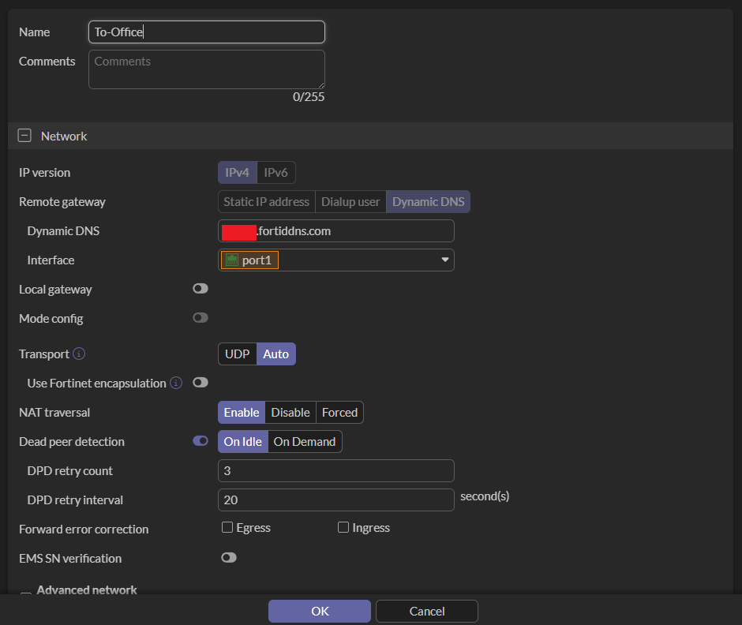

Give it a name, like the destination. Then, for Remote Gateway, leave it at Static IP Address or if you're connecting to a Dynamic DNS, choose that and below it fill in the server you're connecting to's IP address/DDNS. 
In my case, my office Fortigate's router public ip is constantly updated, so I used a dynamic DNS for it.

Note: If you want to access a remote gateway based off a DDNS, you can configure one. This is especially important if you know that your router's public ip address often changes (eg. CGNAT). For configuring a dynamic DDNS, refer to `3_Dynamic-DNS-Setup.md` guide. 
A dynamic DNS CANNOT be created on a free Fortigate VM. You MUST have a device/subscription.

Under that, change the Interface to wan/wan1. In most cases it will always be wan because this is our internet port. If you have a different port facing the internet, use that one.

Keep the rest of the Network fields as default.

Note: If you plan on turning off your Fortigate often (and especially not remember to shut the tunnel down beforehand), I recommend setting the Dead Peer Detection to "On Idle". Dead Peer Detection is a feature where each peer actively checks if the other is alive. If not, it cuts off the connection. On Demand only will only detect a dead peer if there's active traffic going through it. But if you turn off your iniciating machine, the peer on the other side may not register it as a dead tunnel. So it gets stuck and doesn't refresh the connection. "On Idle" will actively check regardless if there's traffic or not.

## HAGLE - Authentication, Phase 1 & Phase 2
### Authentication

There's five important security negociations happening in these next categories, and it's known as HAGLE. The Fortigate setup won't go through these letters in order unfortunally, but we'll talk about each letter as they come up. 
H - Hashing Algorithm 
A - Authentication 
G - Diffie-Hellman Group (secret key exchange) 
L - Lifetime (tunnel duration) 
E - Encryption

First up is "A", authenticating the identity of who we're connecting with. 
Under Authentication, where it says "Pre-shared Key", we will need to set up a pre-shared key between both devices. Both devices will first authenticate the moment they first try to connect. If they don't match, the devices won't connect. 
Any kind of password will work. Make it long. Numbers and symbols. 
You could change the method to Signature instead of pre-shared key, but then that would require a RSA digital signature.

The difference with a signature is that both parties don't necessarily have to know each other to connect, unlike with a pre-shared key you are trusting the other party with knowledge of the key. Basically: 
1. User A's data hash is encrypted. 
2. That encrypted hash gets sent to User B along with data. 
3. User A's public key is used to decrypt. 
4. Then the decrypted value is matched aganist the data hash. 
5. If it matches, it confirms it's the original data and no manipulation occured during transit. 
Anyway, the point is you'd have to generate your own RSA digital signature and having a Certificate Authory (CA) issue you a digital identity... and we are not going to do that.

Next we get to choose the IKE (Internet Exchange Key). 
This allows two devices to exchange encryption keys and negociate rules on the cryptographic parameters, aka Security Associations (SA). 
IKE1 is technically no longer supported  (still configurable though), but IKE2 is the modern choice, and more secure. 
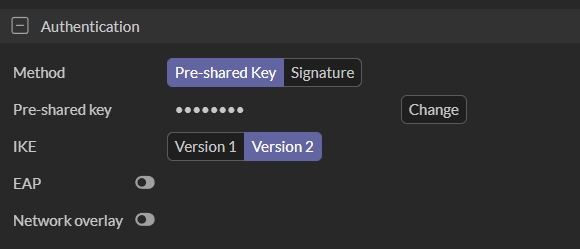

### Phase 1 Proposal 

Phase 1 is the part of the process that establishes a tunnel to securely agree upon the encryption keys to be used when encrypting traffic. The keys will be exchanged using the tunnel established in this phase.

Make sure whatever you decide here it must absolutely match for the destination device as well. These are our cryptographic parameters we're negociating on. While we're at it, let's talk a bit about what we got.

Here is "E" of the acronym, the algorithm for our encryption. If you click the dropdown, you'll see a bunch of different algorithms to choose from. AES128 is pretty common, so it's the default. But if you'd like to understand the different types, feel free to research. However, the free vm Fortigate has limitations to what encryption you can use. DES is all that we're allowed. But anyway, this is the algorithm used to varify data integrity.

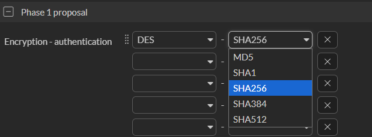

Clicking the dropdown for Authentication is similar. Here we're choosing with hash to use to authenticate with, giving us the "H" of the acronym. You can choose What kind of encryption you want to authenticate with. You can choose as many and varieties as you'd like. The more you add, the more complicated it gets.

Next is "G", for Group. In particular it's the Diffie-Hellman key exchange protocol. What this does is allow two VPN devices to securely establish a shared secret key over an insecure network without transmitting the key itself. 
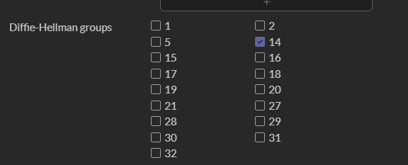

It's actually pretty cool how it works. Check out the image. 
I tried to find one that visualized the math in an easy way. At least this is what helped me understand it.

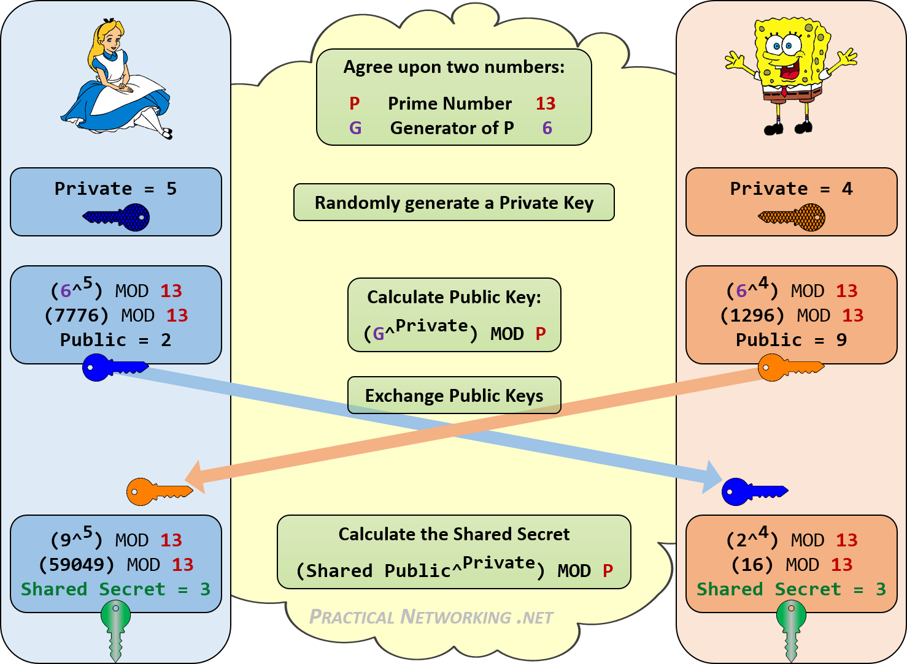

You can pick as many numbers as you want here too, I'm going to just use 14 for this lab. Higher group numbers offer stronger cryptographic security but require more processing power to calculate, so keep that in mind. 
Groups 1 and 2 are obsolete and should be avoided. 
Group 5 is deprecated and not recommended. 
Group 14 is the standard baseline. 
Groups 19 and 20 are highly recommended for next-gen encryption. 
Group 21 offers the highest level of standard cryptographic strength.

And lastly is "L", the lifetime of our tunnel. 
This is how often we want the key to refresh. The default is 86,400 seconds which equals 24 hours (once a day). I'll keep it as is.
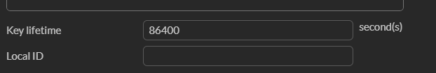

### Phase 2 Selectors

Phase 2 is where the VPN devices agree upon what method will be used to encrypt data traffic. Once this exchange is successful all data traffic will be encrypted using this second tunnel.

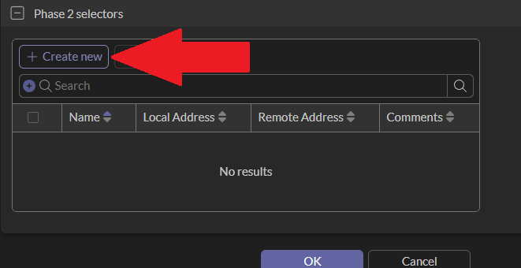

Click on the Create new button. 
If the "Name" here isn't automatically filled out, you can use the same name that you used at the top or call it whatever you want. For simplicy we'll just keep it the same.

"Local Address" is the network we're sending traffic from. Us. 
If you don't know your local address and subnet, you can find it from the left sidebar Network > Interfaces and look for port2 since that is our LAN.

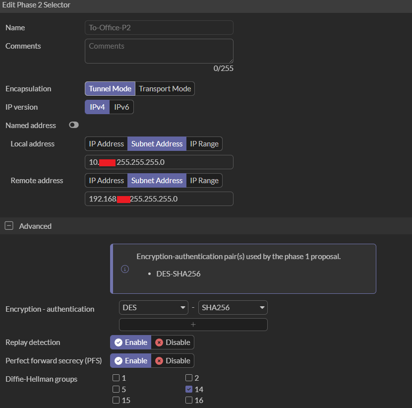
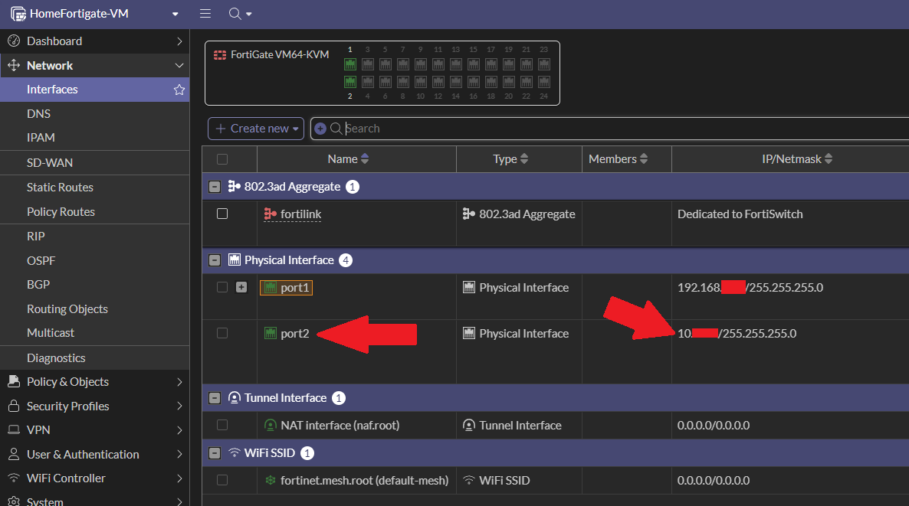

For this we'll allow the entire subnet instead of a specific ip address. 
Remember, if we're doing the entire subnet, make sure the last octet of the IP is a 0 so it covers all avaliable ips. 
If you wanna restrict some users though, best to do that via the Firewall Policy.

Then for "Remote Address", same as above, but instead of our LAN ip, it's the destination local IP.

Once you finish that, click the "+" next to Advanced. This is no different from Phase 1, but again, make sure whatever you pick here matches between devices.

Also, make sure you enable "Auto-negotiate" and "Auto Keep Alive". 
IThis is useful to have on because it will attempt phase 2 negotiation every five seconds until it's established. So if the VPN suddenly goes down, it'll continue to try reconnecting.

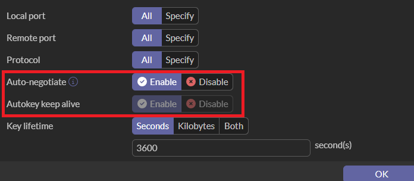

Click OK, then OK again.

## Static Routes

Next we need to create a static route for our traffic. Fortigate needs to know that traffic destined for the office subnet should go through the IPSec tunnel and not on the regular WAN. Without this configured, traffic from our home would just get lost out on the internet.

Go to Network > Static Routes, then click Create New.

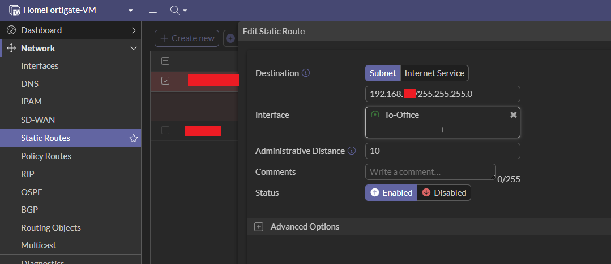

The Destination is going to be the LAN subnet of your destination. 
Then choose your IPSec tunnel that you just created for the Interface. 
Distance you can leave as is. Then click OK.

## Policy & Objects

### Addresses

Before we get to the firewall policy, we need to create Address Objects. These are used as refrences in policies instead of typing out raw IPs every time. Once one is created, it can be used in multiple policies. If the ip changes, all you have to do is update the object and it'll affect all the policies with it. It also just makes reading the policies easier instead of looking at ip addresses.

Go to Policy & Objects > Addresses > Create new. 
Name it and then add the ip subnet. 
Do this both for your home and destination LAN ip.

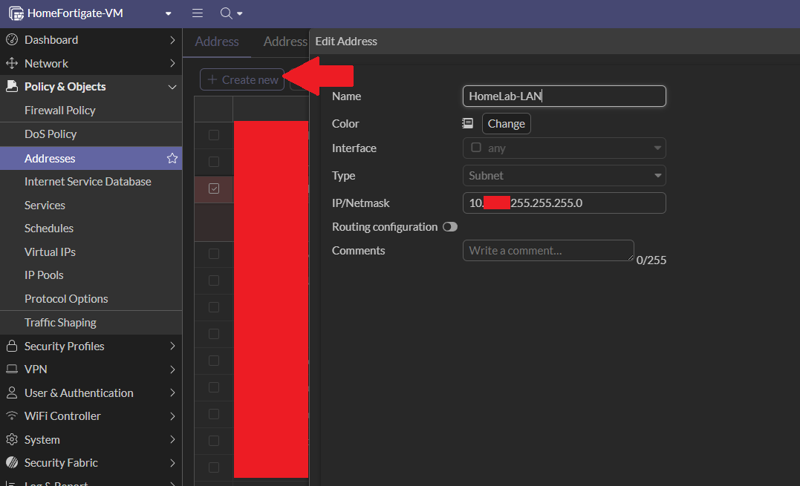
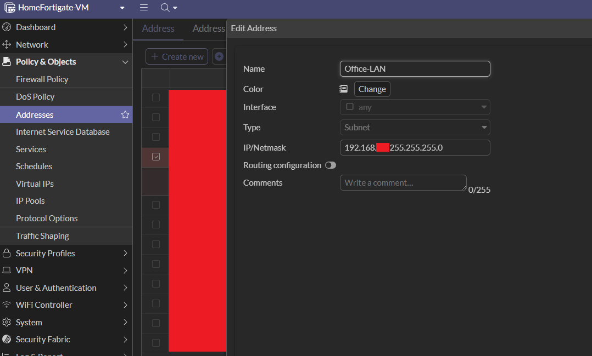

### Firewall Policy

We'll need to create two firewall policies for our IPSec tunnerl. One for outbound traffic and another for inbound traffic. As a note when using the free vm Fortigate, there's a limit of three free firewall policies. So if you plan on testing more policies, you'll only have one left after this.

Go to Policy & Objects > Firewall Policy > Create New. 
Give it a name to know it's your home traffic to destination.
Make sure the "Action" is set to ACCEPT. 
Give it a name, then set the "Incoming interface" to port2 (or whatever your LAN is). 
"Outgoing interface" will be your IPSec tunnel. 
"Source" will be the address we created earlier, for our home LAN subnet address. 
"Destination" is also the subnet address we created for our destination LAN. 
Set "Service" to ALL unless there's only very specific services you want to be allowed in the tunnel. 
If NAT is enabled, make sure you disable it. 
Then scroll down and find the "Logging Options". It's automatically set to security alerts, but for troubleshooting reasons, it might be a good idea to set that to All sessions.

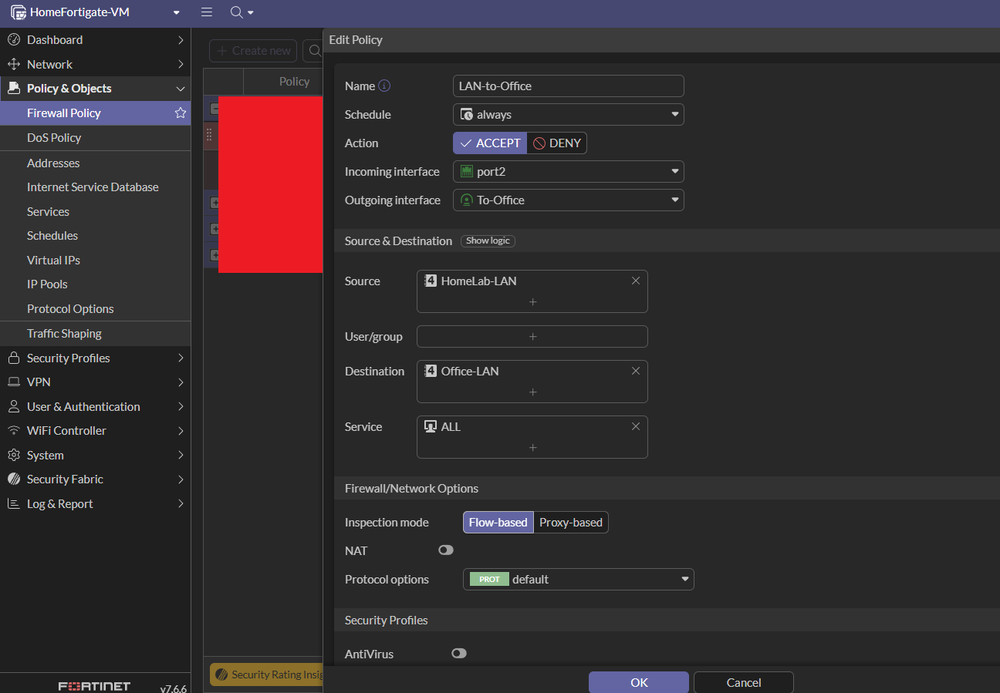
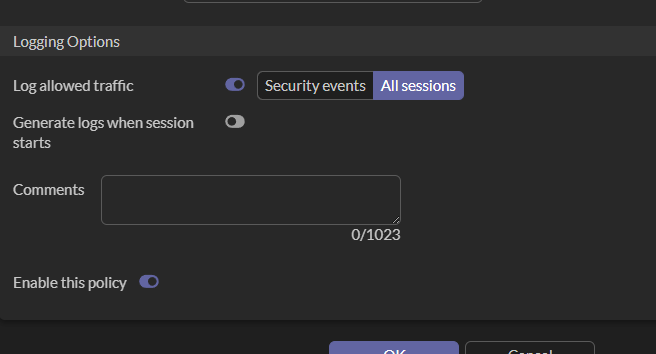

Click OK and now let's make our second policy. Go through the same proccess, except this time everything the opposite. 
→ Name is destination traffic to home. 
→ Action set to ACCEPT. 
→ Incoming interface is still your IPSec tunnel. 
→ Outgoing interface will be port2 (your LAN). 
→ Source is the destination LAN subnet address. 
→ Destination is the home LAN subnet address. 
→ Service set to ALL. 
→ NAT is disabled.

Great! Now that you've finished the above, do the same exact thing on your destination Fortigate. Just make everything the opposite direction/ip.

### Tunnel UP

Once you have that all set up, go to the Fortigate whose router ports you didn't open. In my case, I forwarded the ports on my home router, so that's the side receiving the tunnel connection. You want to iniciate the tunnel on from the side who's router doesn't have port forwarding configured (unless you configured both sides, then either or is okay).

Go back to VPN > IPsec/VPN Tunnels and click on the tunnel you created where it says "Inactive" under Status. If you click anywhere else nothing will happen. You have to click right under the Status category.

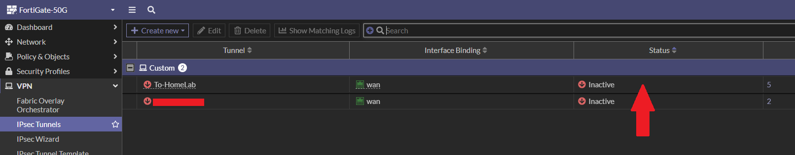

Click on your tunnel and you'll notice two buttons at the top. "Bring Up" and "Bring Down". Click on Bring Up and then Click the phase 2 selector you want to bring up.

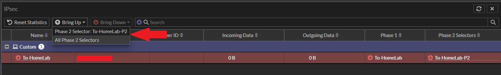

Give it some time to load, it may do some blinking, but once you're connected all the red circles that were once pointing down will turn green and point up. You'll also see a Peer ID (our home server port1 ip).

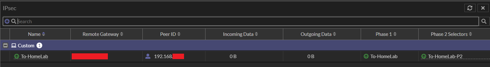

### Adding more Static Routes

The next issue we'll run into is whether or not our routers are even aware that each Fortigate/tunnel exists. We can solve this by either creating a static route on each PC/server, or by adding a static route on each router. Since I was only testing using this on one PC, I chose to add a route to my PC and server. 
The command below (for Windows) tells the default gateway (office router) to send "home server-bound" traffice to Fortigate and not the router. 
`route add -p <home-fortigate-lan-subnet-ip> mask 255.255.255.0 <office-fortigate-lan-ip>`
Then the command below is for our Linux server. When it recieves traffic from the office, it needs to also know to go through its Fortigate instead of its default gateway (home router). 
→ -p makes it permanent. 
`sudo ip route add 192.168.0.0/16 via <home-fortigate-lan-ip>` 
→ The reason why I did a /16 mask, is because the subnet of my office PC is different from the subnet of my office Fortigate. So I had to make it so the subnets didn't matter.

If you wanted to set up a static route on each router instead.....

Office router static route: 
Destination ip: `<home-fortigate-subnet-ip>` 
Gateway: `<office-fortigate-lan-ip>`

Home router static route: 
Destination ip: `<office-fortigate-subnet-ip>` (192.168.0.0/16 to cover all subnets) 
Gateway: `<home-fortigate-wan-ip>`

## End

And that's it! 
To double check you're connected, try pinging the LAN ip of the other Fortigate. You can now even access the GUI of that Fortigate from your browser (don't forget to include the changed port number!).

Note: If you want to connect (SSH) into the home server itself, you'll need to give the home server a matching ip address that's on the same subnet as the Fortigate (your server can have two local ips, so just add another one). I might have made things complicated by using a 10.x.x.x network from the very beginning, but just make sure your networks and subnets are matching throughout the process, otherwise it'll lead to errors. Most of my troubleshooting was related to submasks.

And as you can see from my image below, I successfully SSH-ed into my home server from my office PC/network!

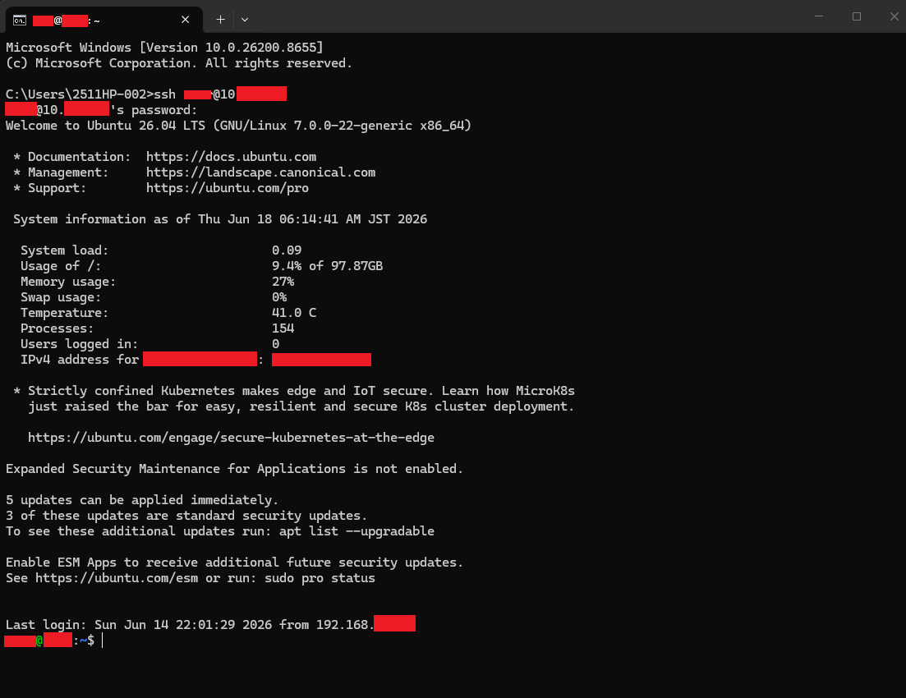