# Dialup IPSec VPN - 20260627

In the last tutorial we got IPSec VPN up and running for site-to-site networks. This time we'll do remote access VPN, otherwise known as Dialup on the Fortigate console. The difference here from Site-to-Site is we're connecting to one Fortigate network from any remote device. This is often used for remote employees needing to connect to their office network to access files while they work from home for example. 
We'll be using FortiClient VPN to access remotely. There's a "VPN only" version that you can download and use for free. `https://www.fortinet.com/support/product-downloads` It's the very last product on the page. Download that for now.

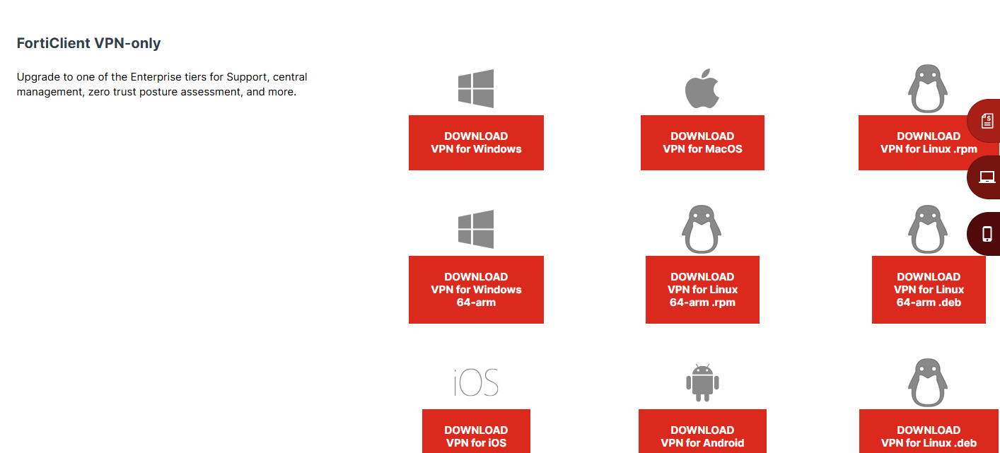

## Create a user group

First we need to create a user group, followed by a user account. This user will be needed to sign into the VPN when we test it. Go to User & Authentication > User Groups > Create new. Then give your group a name and set the Type to "Firewall". Making a group just makes it easier to assign a bunch of users to the same policy under a group name. You can make the user or the group first. If you make the user first, click the "+" by Members and add the user you created. Otherwise you can leave it blank until we create the user. We'll add the group from the user page.

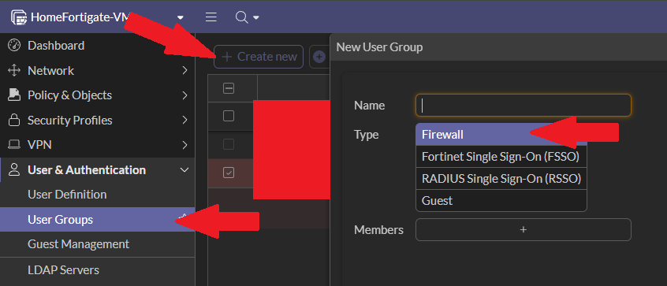

## Create a new user

Next is to create a user to login with. From the same category, go to User Definition > Create new. Here you'll want to kepp Local User, then click Next.

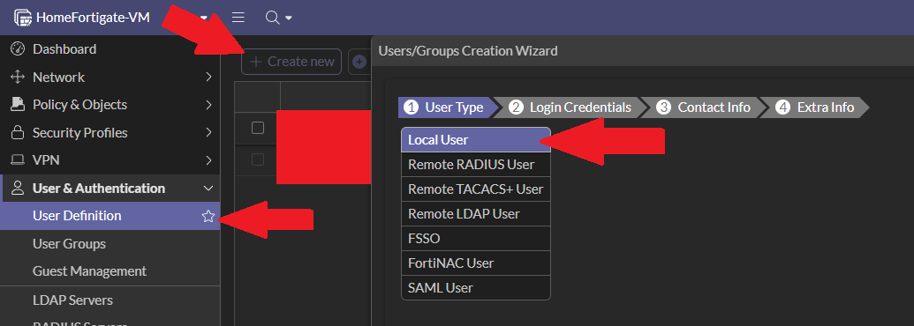

On Login Credentials, give your user a name and password, then Next. 
On Contact Info, you won't be allowed to choose Two-factor Authentication on the free version, so skip by clicking Next. 
On Extra Info, keep the User Account Status as Enabled, and then click the slider for User Group. Here you'll be able to add the group we just created. Then Submit.

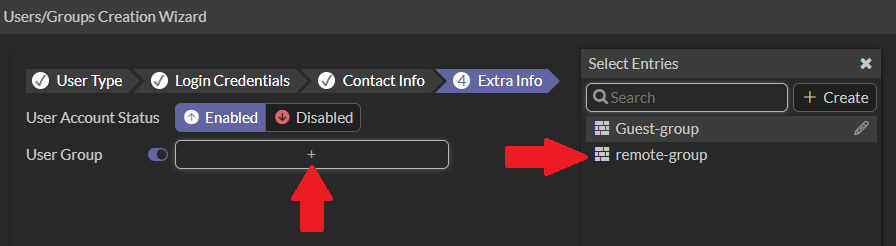

## Create a firewall address

After you finish the above, we need to create a firewall address for the local subnet we want to connect to. 
This part is exactly the same as how we created addresses for the HomeLab and Office during the Site-to-Site setup. Copy and pasting the reason we need this again: These are used as refrences in policies instead of typing out raw IPs every time. Once one is created, it can be used in multiple policies. If the ip changes, all you have to do is update the object and it'll affect all the policies with it. It also just makes reading the policies easier instead of looking at ip addresses. 
For testing, we'll use a random local subnet of 10.1.1.0/24.

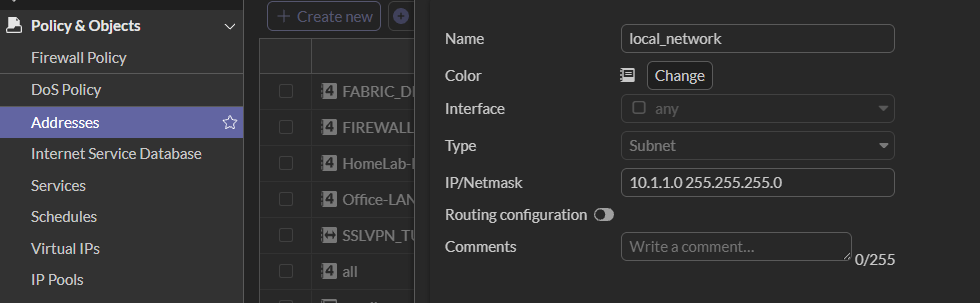

## Create a Dialup VPN tunnel

Great, now we can move onto making the VPN tunnel. 
Go to VPN Tunnels > Create new > Custom IPsec tunnel (or however your UI looks).
Again, depending on your version, your UI may look different, but the fields are generally the same. 
→ Give your VPN a name. I went with "remote-test". Then for the Remote gateway, choose Dialup user. Older versions may say "Remote Access" instead of Dialup. Choose that if that's the case. This is us saying we what kind of VPN tunnel we want to create. 
→ For Interface, choose the port/wan where incoming traffic will be coming through. So your internet port. In our case our WAN is port1, so choose port1. 
→ Next we want to give the incoming users an ip address on the local network. You can choose DHCP, but as an example case we'll have ips assigned between the range of 10~250 on the network. 
Then give it a DNS ip address (I used Google), and enable Split Tunnel. This means only specified networks will be accessable by remote users through the encrypted VPN while all other traffic will have direct access to the internet. In more simplier terms, it means that browsing YouTube or Google won't go through the VPN. But with split tunnel, only traffic specifically for the work server goes through it. This improves speed for general activities and puts less load on the company network. 
→ Of course when you enable Split Tunnel, be sure to configure it to the Firewall Address we just made earlier. In my case, I had named it "local_network".

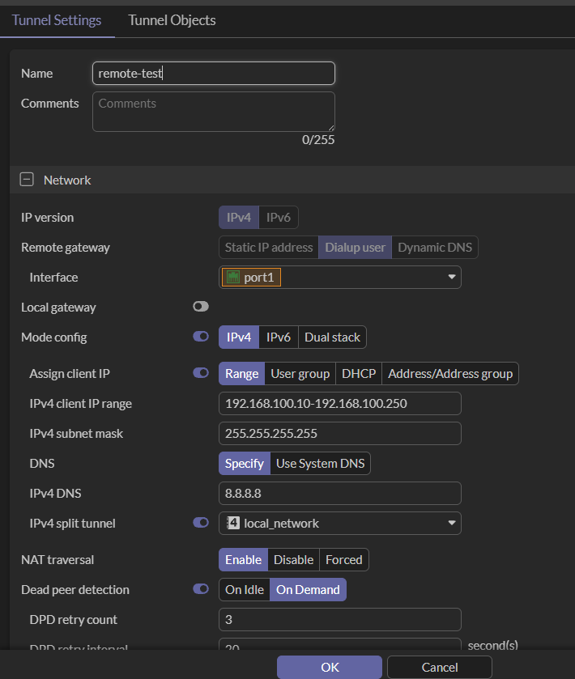

### Authentication

Next to the authentication part. 
Give it a pre-shared key (similar to Site-to-Site), but this time we will be choose IKE1 on Aggressive. You can use IKE2 instead of IKE1 (which you probably should anyway), but for some reason I couldn't save my settings when I tried. It might be due to vm limitations (I'm not sure), but if you do try to configure with IKE2, you will also need to enable EAP (should appear after selecting IKE2).

IKE1 with Aggressive means user identifying information is sent upfront in the first negociation message. This means Fortigate can look up who you are if your ip address is unknown. Remote users often have dynamic ips (especially if on the go), so Aggressive mode bypasses IKE1's main mode which requires a fixed known ip address from both sides. Unfortunally this information is not encrypted and an attacker could snag the handshake if listening on the network. IKE1 is not recommended, but for this tutorial (since it's the only thing I could get to work) it's what we'll be using.

Then, since we're using IKE1 on Aggressive, choose Any peer ID as the Accepted peer ID, choose Auto Server as the XAuth type, and for the User group choose Specify and add the group we created earlier (in my case "remote-group"). If you choose Inheit from policy instead, you'll have to specify the user group and the remote access firewall policy. It's easier to specify the remote users instead.

### Phase 1 & Phase 2

Then we have our Phase 1 Proposal. 
This part is exactly the same as how we configured it on our Site-to-Site VPN. If you need a refresher on how to configure this and/or the details about what it all means, please refer back to `2.1_IPSecVPN-Site-to-Site.md`. Below are the screenshots for what I did.

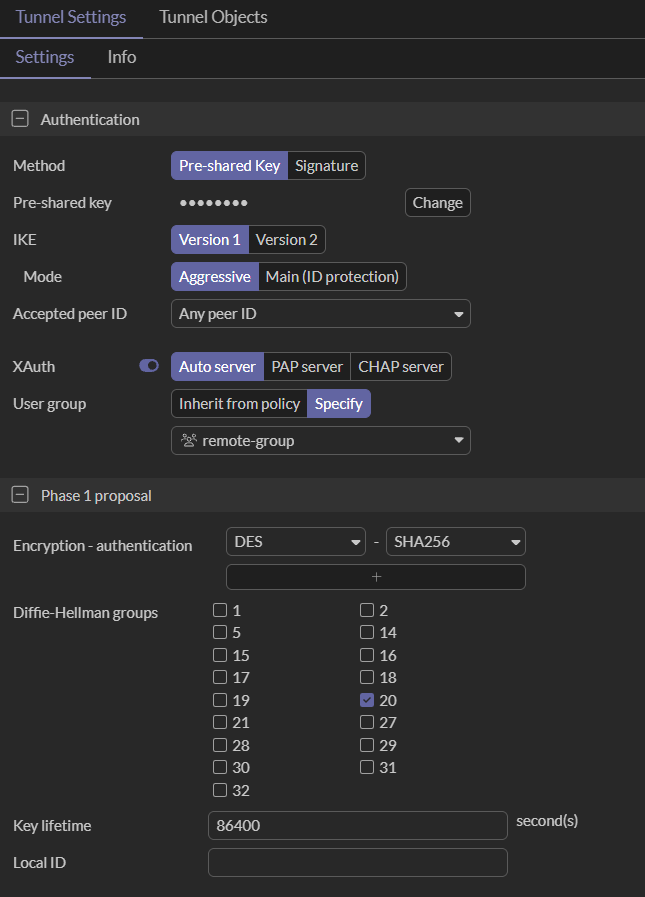
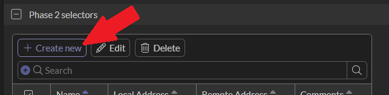

After you decide on your authentication and encryption rules, move onto Phase 2 Selectors. This too is set up exactly as our Site-to-Site instructions, but for manual purposes, I've included screenshots of my settings below. When you get to Local address and Remote address, leave those to "any", which is all 0s for the ip and subnet. Also remember to enable Autokey keep alive.

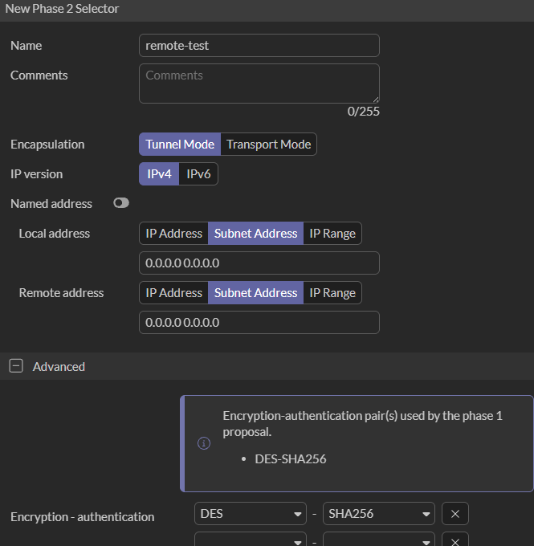
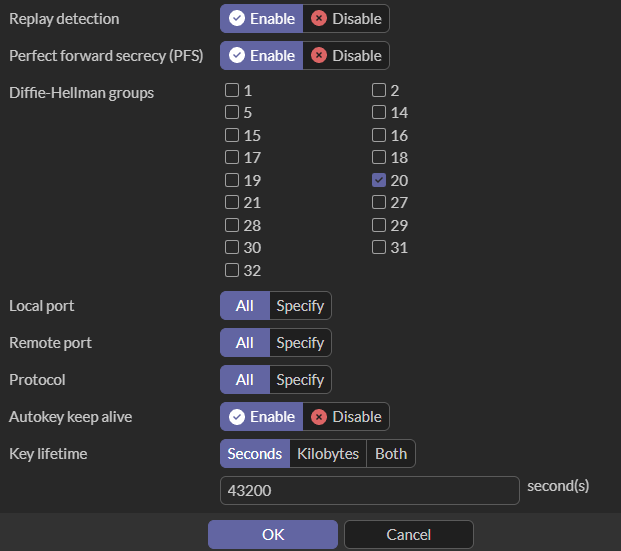

## Create a firewall policy

Next we need to create a firewall policy to grant remote users access to the 10.1.1.0/24 network. 
→ Create a new policy and give it a name. 
→ Incoming interface will be the VPN tunnel name we just created. 
→ Outgoing interface is our LAN port. 
→ Set Source to "all". We don't need to set a user group here because that's already set in the VPN configuration. 
→ Set Destination to the local address we created earlier. And for testing purposes let's set that to "ALL" as well. 
→ If NAT is enabled, disable it. 
→ And change your Logging Options to log All sessons traffic, just in case you need to do some debugging. 
→ Click OK.

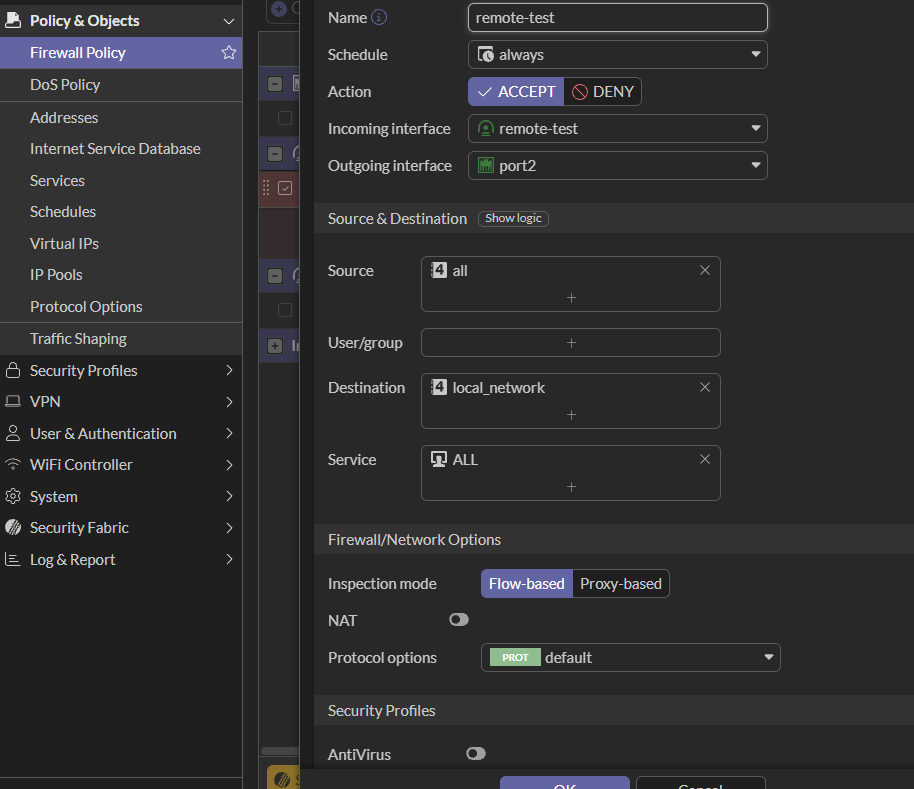
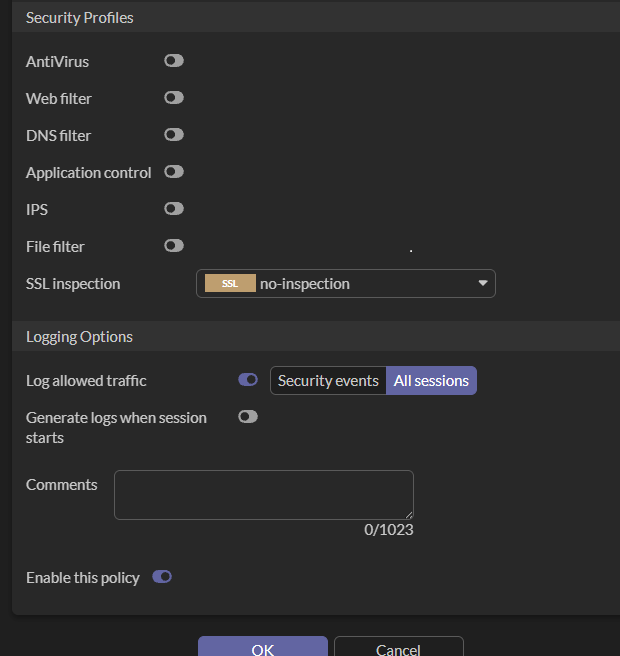

## Login via FortiClient VPN

Awesome! We finally finished all the configurations. Now we can run the FortiClient VPN app we downloaded at the very beginning of this maunal.

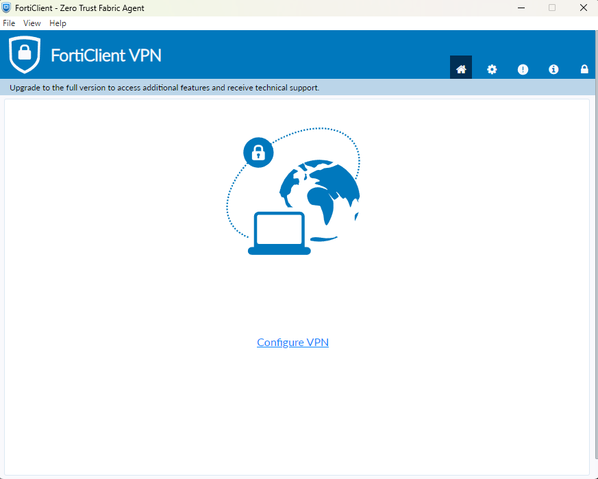

When you see the above screen, click "Configure VPN". 
Then below, select the tab that says IPsec VPN and start entering the following: 
・Connection name, the name you gave the VPN. 
・Remote Gateway, this will be whatever the WAN ip (public ip) of our Fortigate is. You can check what that is from Network > Interfaces. If your company is using a DDNS though, you can use that DDNS website as the remote gateway. For this lab, it's the ip of our port1. 
Then open up Advanced Settings by clicking the "+" sign and fill in the VPN Settings, Phase 1, and Phase 2 options.
・Authentication Method, Pre-shared key and the key we gave the tunnel. 
・IKE is Version 1 with a Mode of Aggressive.
・Phase 1 and Phase 2 options should match what you assigned when configuring the tunnel.

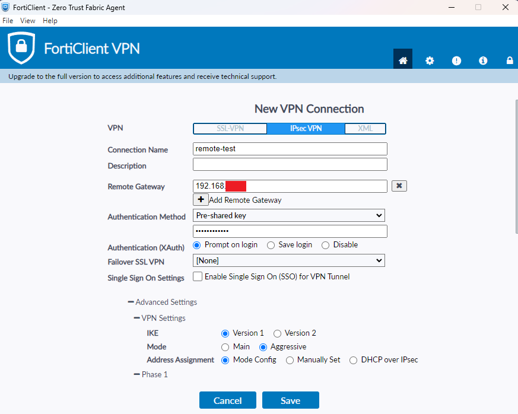
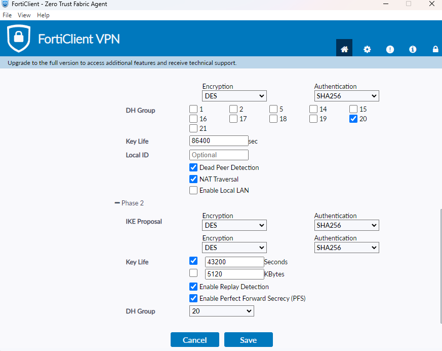

Click "Save" and then you'll be shown a login screen. Here sign in as the user for the remote group you created earlier. Then click "Connect".

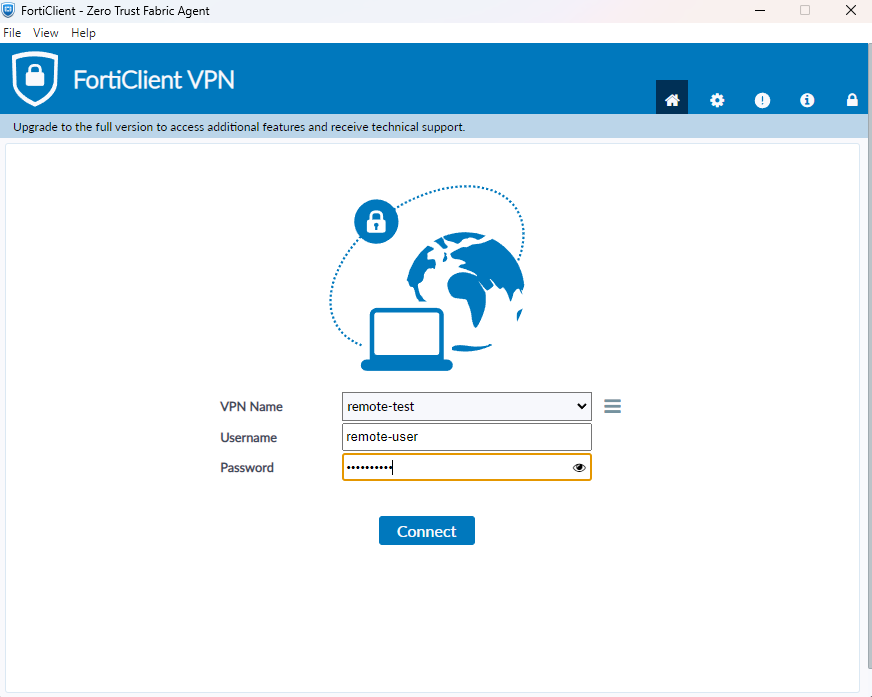

If your connection is successful, you should something similar to the image below. You've been given one of the ip addresses within the range you specified in the configuration, as well as bytes being sent! Congrats! You've got a working remote VPN! 
And just to double check, you can test by pinging an ip address on the destination network (eg. 10.1.1.254) after connecting. If the ping reaches, your remote connection is getting through. 
Also you can check to see the vpn network connection on the GUI as well, just as we did on Site-to-Site. Go to VPN > VPN Tunnels and double click your tunnel under the Status category. Or you can add an "IPsec" widget to your Dashboard to see real-time connectivity.

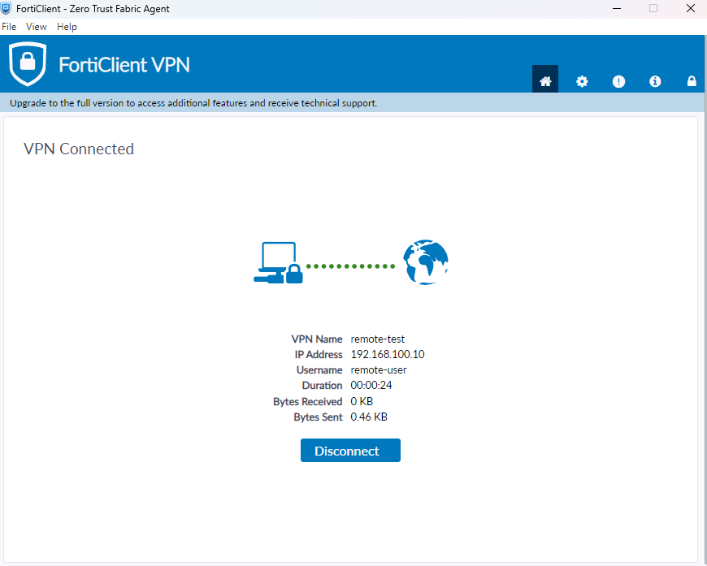

[IPsec Widget for Dashboard]

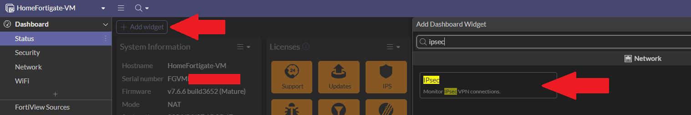