# 静的・動的マルウェア分析 - 20260315

### AIで翻訳されています。

今日は、東京電力(TEPCO)になりすましたフィッシング詐欺の一環として発見されたファイルを扱います。脅威アクターはソーシャルエンジニアリングを利用し、偽の「toshiba-co.jp」メールを作成して、悪意のあるファイルがホストされていたfiles.fmへのダウンロードリンクを送りつけました。よくあるフィッシングの手口です。さて、実際にこのファイルを入手できたので、早速見ていきましょう!

ですがその前に、悪意のあるファイルを見る前に、Defenderのアラートとメール自体を確認しましょう。 
以下の最初の2枚の画像で、悪意のあるファイルがユーザーのOutlookメールアカウントからクリックされたリンクに由来することが確認できました。ログにはクリックされたリンクとクリックされた時刻が記録されています。 
次の画像では、Defender内でKQLクエリを編集し、誰がユーザーにこのメールを送ったのかを特定しました。3つのアドレスが表示されましたが、最も早いものはアメリカのオフショア支社にいる別の社員からのものでした。当社は日本のユーザーログにしかアクセス権がなかったため、ログの調査はここまでしかできませんでした。しかし幸運なことに、クライアントから悪意のあるメールのスクリーンショットを送ってもらうことができました。

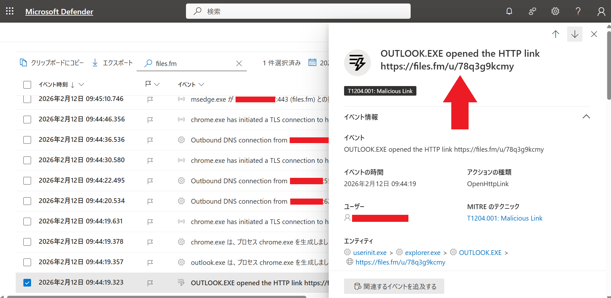
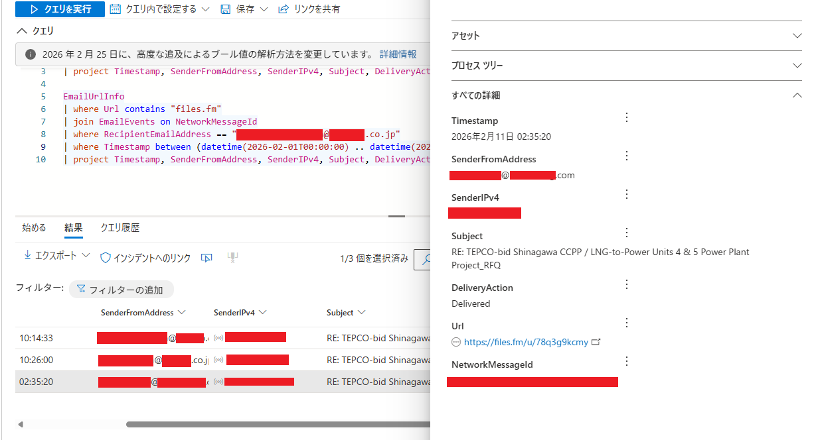

下の画像は、クライアントが受け取ったフィッシングメールのスクリーンショットです。 
メールは英語で書かれていますが、内容としては送信者が東京のプロジェクトに関する仕事があるふりをしていました。オフショア支社は日本のプロジェクトを扱っていないため、このメールを日本オフィスのユーザーに転送しました。そして社内から転送されたメールだったため、ユーザーはその正当性を疑う理由がありませんでした。 
しかし、メール自体にはすでに危険信号がありました。画像内でそれらを指摘しています。 
1. 東芝のメールアドレスが誤っています。脅威アクター(3名)は「toshiba-co.jp」というメールアドレスを使用していました。しかし、少し検索すればわかる通り、東芝の公式メールアドレスは「toshiba.co.jp」で終わります。メールアドレスに「-」が入ることはありません。 
2. メールの一番下にある漢字の名前が、英語表記と一致していません。オフショア支社では気づかなかった可能性が高いですが、日本チームであれば気づけたはずです。そのすぐ下にも、実際のメールアドレスが送信者のメールアドレスと一致していないことがわかります。

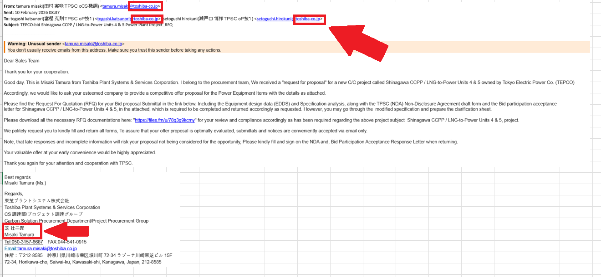

よし。それではファイルを入手できたので、ここで何が起きているのか分析していきましょう。 
RARファイルを解凍すると、中に怪しい .js ファイルが入っていた。

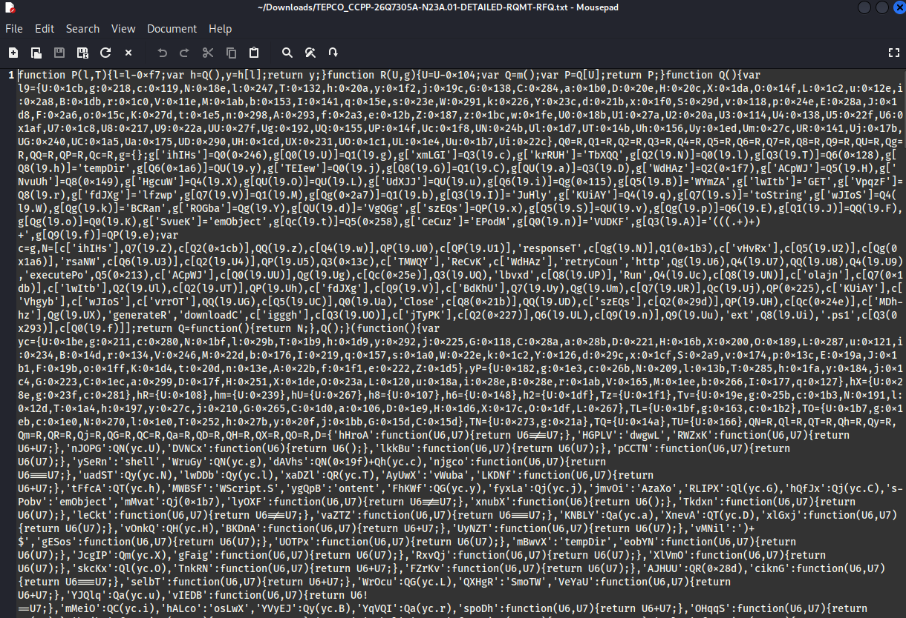

これはひどい。beautifier.io のような jsビューティファイアにかけて、まず読めるようにしよう。

整形後のコードは2,100行以上。ざっと見た感じ、文字列配列の処理と、中央にどでかい実行関数がひとつある構成だ。つまりこのコードは、配列のインデックスを次々に参照しながら文字列を取り出し、何らかのコマンドを組み立てるだけのものだ。 
全部掘り下げるのは時間の無駄なので、読める部分だけを拾っていく。

ActiveXObject が出てきた時点で、これはブラウザ上で動くJavaScriptではないとわかる。Windowsでダブルクリックするだけで実行される、JScriptだ。

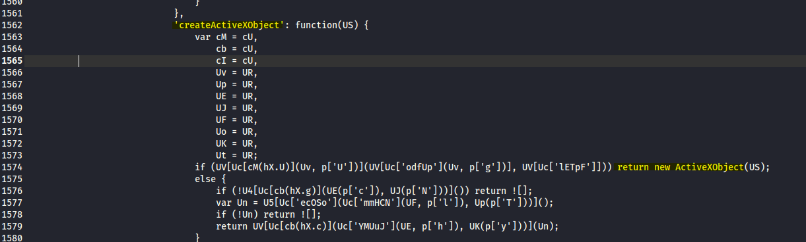

おや。外部スクリプトを呼び出すIPアドレスが見つかった。隠す気もなかったのか。Tempフォルダに保存されるようになっている。 
http[://]91.92.243.254:7777/91.92.243.254/vickytwo/ENCRYPTED[.]ps1

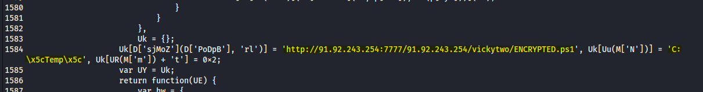

以下は"shell" と "http" も確認できる。その上の部分は、文字列を連結して ActiveXObject を生成しているようだ。 
これらは起動時に実行されるコマンドと思われ、永続化を目的とした手口だ。

PowerShell が実行されている箇所はこちら。

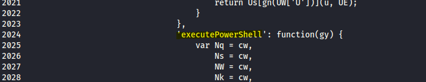

下記の2つの文字列配列を見ると、ダミー文字列の合間に、コマンドの断片が混じり込んでいるのがわかる。見つかった部分をすべてハイライトしてある。断片的ではあるが、このコードが何をしようとしているか、少しずつ読み解いていけそうだ。

ハイライトした読み取れる文字列からPowerShellコマンドを組み立ててみよう。 
'powershel' + 'l.exe%20-no' + 'p%20-ep%20byp' = **powershell.exe -nop -ep byp** 
最後の "ass" の部分が足りない。コード内を検索するとすぐに見つかるはずだ。

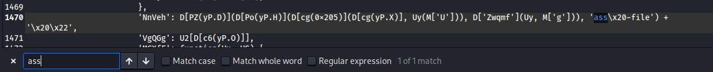

ビンゴ！ 
`powershell.exe -nop -ep bypass -file` 
実行ポリシーのバイパスが行われていることが確認できた。 
さらに後ろに \x20\x22 が連結されている。ファイルパスか……？
正直なところ、ここまで分解してもまだ核心には届いていない。 
残念ながら、このコード単体でわかることはここまでだ。 
ただ、ENCRYPTED.ps1 がダウンロード・実行されると、Tempフォルダに何かが展開され、先ほど組み立てたPowerShellスクリプトで実行される流れになっているのはほぼ間違いないだろう。

実際に動かしてみるために、AnyRunで解析してみよう。 
執筆時点では、ファイルを配信していたサーバーはすでにダウンしている。幸い、まだ稼働していた頃に別の誰かが同じファイルをアップロードしてくれていた。以降はこのサンドボックスの結果を参照する： 
https://app.any.run/tasks/d75c093a-dff4-4652-9a31-490c649a1003

複数の検知が出ているが、まずここに※目しよう。 
WinRARの時点ですでにフラグが立っている。実行されると wscript が起動する——これは先ほどの文字列配列にも WScript が含まれていたので、つじつまが合う。 
次にPowerShellスクリプトが動く。さっき組み立てたものと同じで、ファイルパスとファイル名が追加されている。場所は確かにTempフォルダ内だ。 
続いて aspnet_compiler.exe が登場する——これは後で詳しく見る。 
さらにもう一度 wscript.exe が動き、今度は別のファイルを実行するPowerShellスクリプトが走る。これは多段階のドロッパーチェーンと見て間違いないだろう。

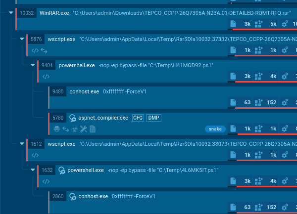

では、aspnetファイルの中身を見てみよう。

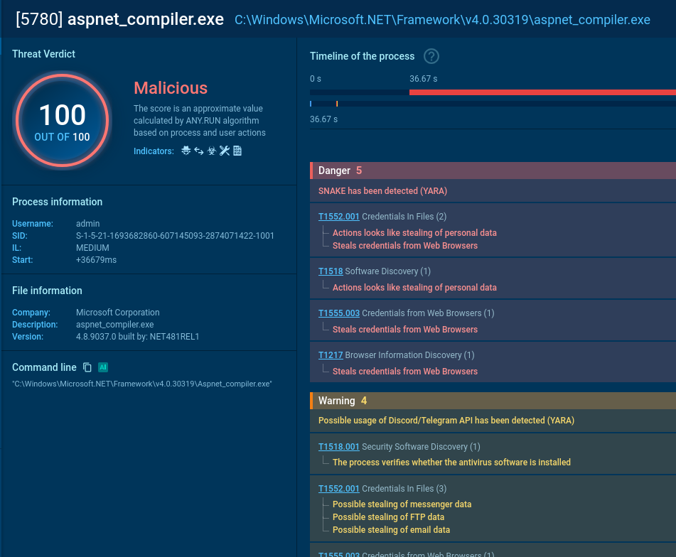

aspnet_compiler.exe はPC上でWebアプリをビルドするためのツールだが、いわゆる「LOLBin（環境寄生型ツール）」に分類される。Microsoftの正規 .NETフレームワークに署名されているため、セキュリティ製品に検知されにくく、攻撃者に悪用されやすい。このコンパイラが実際に悪意あるコードをビルドし、正規プロセスとして紛れ込むことで検知を回避していると考えられる。

結果を一目見ただけでも、ファイルやWebブラウザからデータを盗もうとしていることがわかる。警告セクションに「Discord/Telegram APIの利用の可能性あり」という記載があるのも興味深い。これらのアプリがC2サーバーとして使われているのかもしれない。 
次に、2つのwscriptを見ていこう。

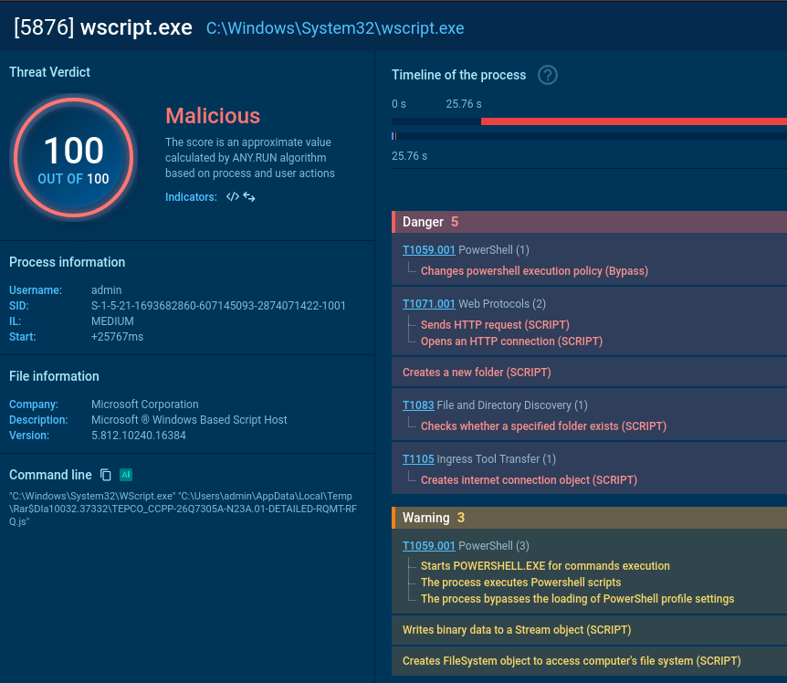
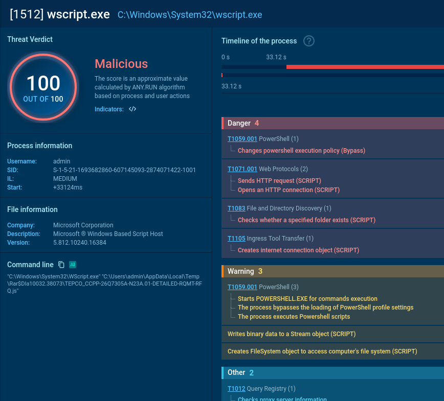

まずコマンドラインを確認する： 
`C:\Windows\System32\WScript.exe" "C:\Users\admin\AppData\Local\Temp\Rar$DIa10032.37332\TEPCO_CCPP-26Q7305A-N23A.01-DETAILED-RQMT-RFQ.js` 
これで ENCRYPTED.ps1 が何をしていたか、だいたい見えてきた。Tempフォルダ内に Rar$DIa10032.37332 というフォルダを作成し、その中に元のファイルと同じ名前の TEPCO .js ファイルを生成したのだ。ファイル名を同じにしているのは、見かけ上は同一ファイルに見せかけるためだろう。ただ中身のスクリプトは別物のはずだ。このファイルが実行されると、HTTPリクエストを送信して H41MOD92.ps1 をTempフォルダにダウンロードし、PowerShellでそれを実行する。このスクリプトが aspnet_compiler.exe を呼び出す役割を担っていると思われる——「アセンブリを動的にロードする」という動作からも読み取れる。 
特にHTTP接続の詳細を見ると、.jsファイル内で見つかったのと同じ http[:]//91.92.243.254:7777/91.92.243.254/vickytwo/ENCRYPTED[.]ps1 に接続しようとしているのが確認できる。

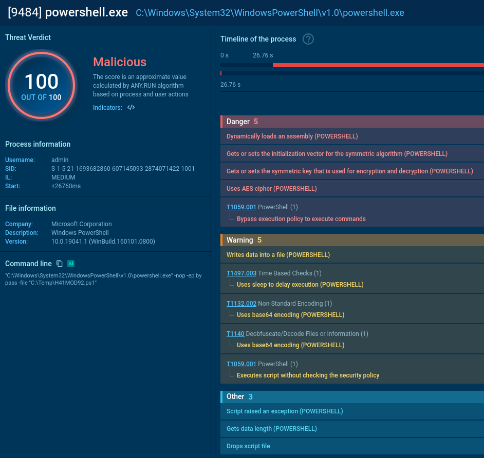

2つ目の wscript.exe も基本的な流れは同じだ。 
ただしコマンドラインには別のフォルダ名 Rar$DIa10032.38073 が現れる。新たにフォルダが作られた痕跡は見当たらないため、この2つのフォルダと .js ファイルは、ENCRYPTED.ps1 が実行された時点でまとめて生成されていたと考えられる。つまりそれぞれのスクリプトの内容も異なるはずだ。 
このファイルもHTTPリクエストを発行し、4L6MK5IT.ps1 をTempフォルダに落としてPowerShellで実行する。PowerShell のタブを見ると、データをエンコードする処理が行われているようだ。

一連の感染の流れを整理するとこうなる： 
<pre style="background:none; border:none; padding:0; font-family:monospace; line-height:1.2;">
TEPCO .jsファイル 
│   └── ENCRYPTED.ps1 をダウンロード・実行 
│       ├──%TEMP% 内に RarDIa10032.37332とRarDIa10032.37332 と Rar DIa10032.37332とRarDIa10032.38073 を作成 
│       ├── Rar$DIa10032.37332 の TEPCO.jsファイルを実行 
│       └── H41MOD92.ps1 を実行 
│           ├── aspnet_compiler を呼び出し 
│           └── ペイロードをコンパイル 
│       ├── Rar$DIa10032.38073 の TEPCO.jsファイルを実行 
│       └── 4L6MK5IT.ps1 を実行 
</pre>

とはいえ、これはあくまで私の見立てに過ぎない。

aspnet_compiler が Snake YARA としてフラグされていたので、このマルウェアがどのようなものか調べてみよう。

オーストラリアの cyber.gov.au によると： 
「Snake YARA」ルールとは、Snakeマルウェアを検知するためのセキュリティ検出シグネチャだ。Snakeはロシア連邦保安局（FSB）が開発した高度なサイバースパイツールで、20年以上にわたって世界中の政府機関や重要インフラからの情報窃取に使われてきた。YARAルールは、このマルウェアのファイルパターンやメモリ上の特徴を検出するために設計されている。

……なかなかどうして、面白い相手じゃないか。