# Phishing Campaign Email Analysis - 20260714

A client got a phishing email (unopened) and was curious what was on it. They asked us if we could look into it and sent us a .msg file they downloaded from Outlook. I downloaded the zip file provided by the client and extracted the .msg file inside. To review the message contents, I converted it to .eml format and renamed it to "phishing" for clarity. The company name and employee name throughout the email have been redacted.

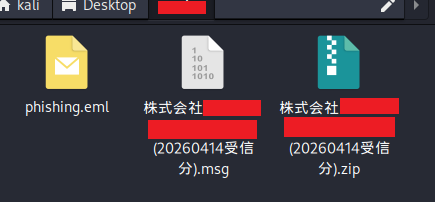

Opening phishing.eml in a text editor reveals the following (partial screenshots of the full message):

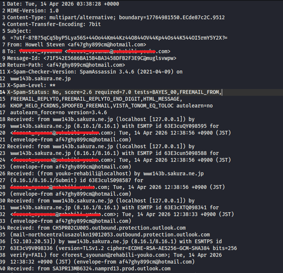
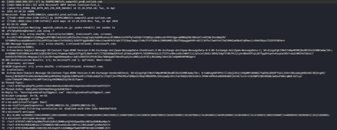
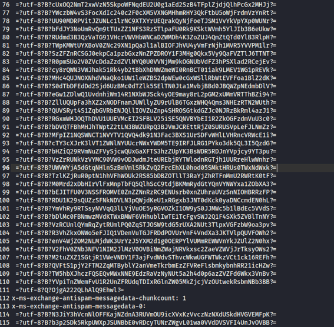
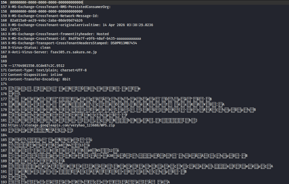
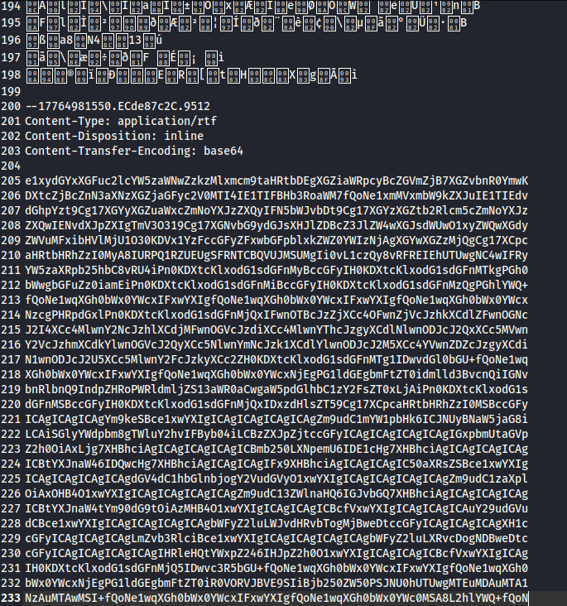

There's a large chunk of base64 in here, along with some 8-bit encoded sections. I'll decode those shortly, but first let's look at the headers.

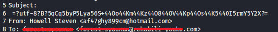

Decoding the base64 subject line gives us: 株式会社xxxx<_recipient-name_>
The sender is listed as "Howell Steven," using the email address: af47ghy899cm[@]hotmail.com
Addressed to: <_recipient-name_>@xxxx.com

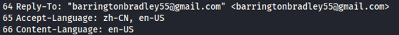

In the header I also noticed a "Reply-To" address set to barringtonbradley55[@]gmail.com. 
So, the sender name, email address, and repy-to, none of these match the other. Curious, I looked into whether an account under that name existed — it's possible this is either a compromised account or an entirely fabricated one. The original sender address is likely disposable, meaning if the recipient tried to reply, the response would actually route to this active Gmail account instead. 

I booted up my Kali vm and first I tried using `holehe` to do a search if an account was found on any 120+ sites in its database. There was not a single match. 
Then, I tried to see if the email had appeared in a databreach using the tool `h8mail`. No compromise found. 
Lastly, I gave `theHarvester` a try just to see what other OSINT data I could pick up. No luck here either. There's a good chance this is just a throwaway account. 
I did the same for the garbbled up hotmail email address as well and got no results.

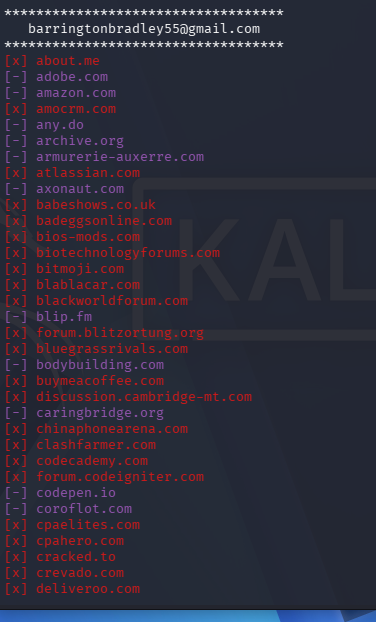
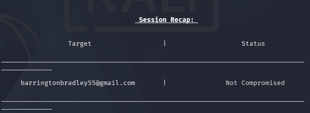
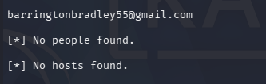

Another detail worth flagging that I noticed right under the Reply-To: the Accept-Language header is set to "zh-CN." I'll come back to that later, but keep it in mind.

I went ahead and decoded the base64 I noticed earlier and found a large amount of embedded HTML markup:

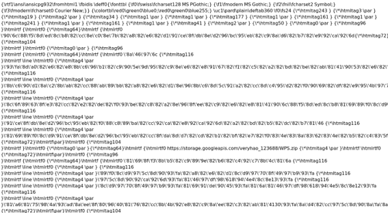

This turned out to be RTF-formatted content with HTML tags and Shift-JIS encoded text embedded inside. I converted it to a readable format. As seen earlier in the .eml file, there was also 8-bit text and a link present:

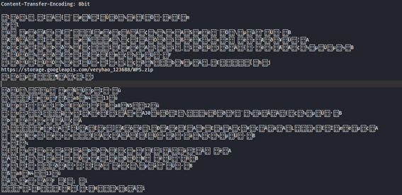

The base64/RTF content matches what's shown here. The base64 in this case seems to just be part of the MIME structure, but it was good to check just in case. Once decoded, the actual body of the email reads as follows:

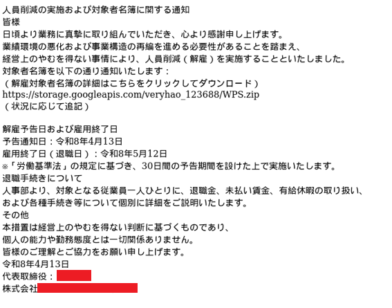

Whoever sent this email was attempting to lure the recipient into clicking a Google Storage link to download a file named "WPS.zip." When I tried accessing the link myself, it had already been taken down — it appears to have been reported and is no longer active.

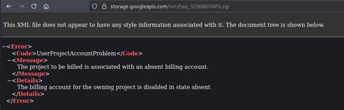

So I wasn't able to retrieve the file directly. That said, I did turn up some related intel. A file with a similar folder name (veryhao_123866) had already been posted about on X, along with a corresponding VirusTotal entry. The only difference is the filename — that one was LOP.rar. https://www.virustotal.com/gui/file/8f3f3af66758d7bf3e8fb88af42a16b25b2faafb6d78a79f4f7fe9fd338408c3

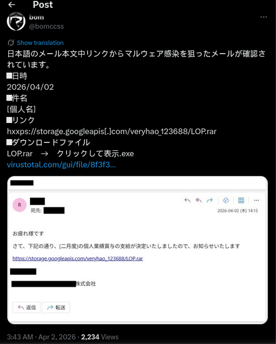
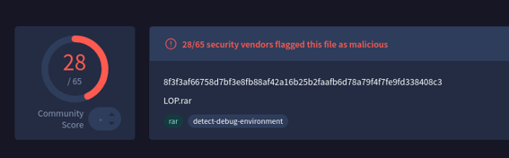

I also did some digging on VirusTotal. 
I tried searching for the URL path for the WPS.zip file. VirusTotal showed an "undetected" vertict, however, looking at the Relations tab, we can see two files associated with the url. 
Our WPS.zip as well as the lop.rar file mentioned on the X post. The WPS.zip files is also showing a detection score of 38/64. So I clicked on it.

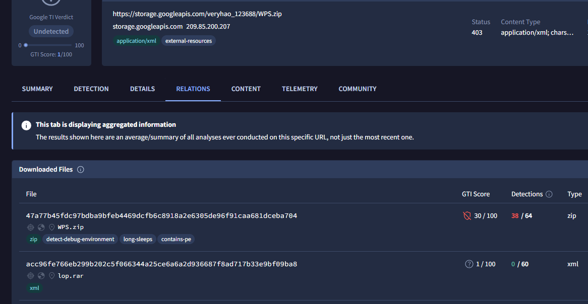

Under the Relations tab again, we can see the URL from the original email, and scrolling further down it shows a Bundled Files of a file called クリックして表示.exe, a Win32 exe file.

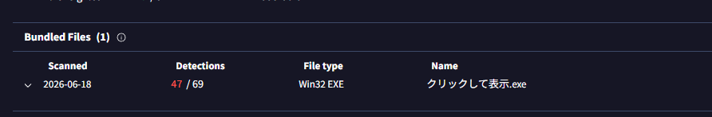

Now, back to that "zh-CN" detail in the Accept-Language header I mentioned earlier — this indicates that the primary language setting on the browser used to send the email was Simplified Chinese, which strongly suggests this phishing email originated from China. Adding further weight to that theory is the folder name itself: "veryhao_123688." In Chinese, "hao" (好) means "good," so the folder name essentially translates to "very good."

At the time of the investigation, details about this phishing campagin weren't avaliable, but as of recent (2 months after initial investigation) VirusTotal has published a report about this file. 
I clicked on クリックして表示.exe on VirusTotal to see the details on it. 
In the final image below, by the looks of the file name, we can see that the file disguises itself as a real Windows proccess (secinit.exe) - an attempt known as masquerading in MITRE ATT&CK. 
Then located on the right side of the screenshot, VirusTotal has a report with the title "Attack Campaign Targeting Japanese Organizations Using PoisonX Driver". Clicking on this report will give us a detailed explanation on the attack - in short they have the victim download a known vulnerable driver to gain kernel access - but what I want to point out is that it states the Source Region is China. This also aligns with the Accept-Language header I noticed and is confirmation that my hunch was correct.

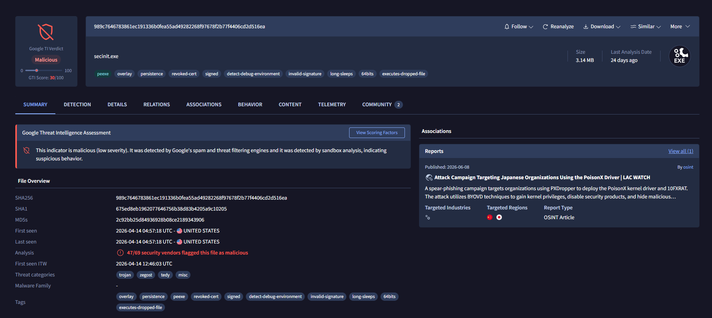
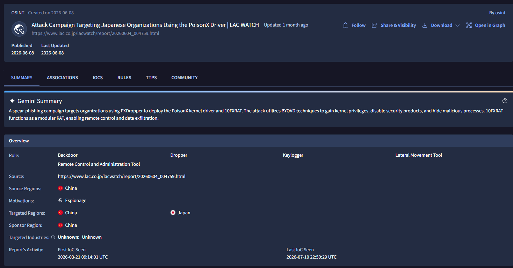