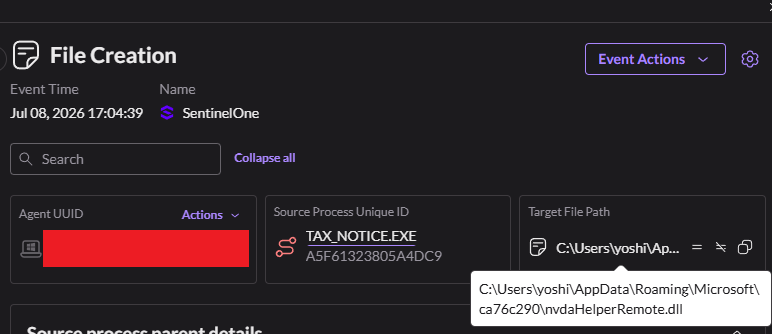

# DLL Sideloading Phishing Log Analysis - 20260714

We got an alert that a user downloaded a zip file, and the file inside it ran as an image file. 
From the logs that we had, we can see that around 17:04:10 there was a file creation matching the same zip file we got an alert for from OUTLOOK.EXE. 
Considering the name of the file, we can already guess this phishing scheme is trying to pretend to be an e-invoice/billing document. Below is what the file path looks like: 

The zip file `楽楽明細_適格請求書_RKM-20260616.zip` was downloaded and extracted to reveal the image file `RKM-20260626.img`. 
It's quite possible that the user had extention names hidden in their file explorer and didn't notice the unusual extention name. 
Before we move forward, let's throw that file hash into VirusTotal anyway and see what we get.

Earlier in the logs, I noticed smartscreen.exe ran in an attempt to scan the downloaded file, but even then it failed to detect the malicious file when it ran. The reason for this is, even though this file got a MOTW (Mark of the Web) which triggered SmartScreen, it doesn't look what is inside mounted drives. This is one clever way to avoid detection from built in scans. And then once the mounted drive is ran, it's treated as a local disk and whatever is ran from it isn't considered an internet download file (MOTW) - this avoids SmartScreen from triggering again.

After the user ran this image file, another alert came in for a file called `TAX_NOTICE.EXE`. Right away by looking at the file properties, we could see that the file path is coming from a docked CdRom (the previous .img file). Major red flag already. What's also interesting is the publisher's name: `NV Access Limited`. A quick google search tells us that they make an open-source screen reader (NVDA) for Windows for the blind and vision-impaired. The file hash is officially signed too when checked on VirusTotal. That's awfully strange though, considering this is "supposed" to be an invoice file.

[More meta data when the Source Proccess Image Product Name does not match the image name]

Let's take a look at the Storyline. Here we can see some other interesting processes. `consent.exe` and `schtasks.exe`. 
consent.exe was most likely a popup asking the user if they're sure they want to give this file priveleges to run, aka to install the virtual driver to their system, a common dialog box that appears before running programs. Again, another red flag. 
Then the commandline used in schtasks.exe, however, shows something even more interesting. 

A scheduled task is being created for RuntimeBroker.exe every time the user logs on and is given the highest privleges. 
We have quite a few obvious red flags here. 
1. The scheduled task that's being created has an unusual name of "RuntimeBroker_ITR_67AC". 
2. This task is then being referred to a random folder inside AppData. If this were the real Windows runtimebroker, it would be coming from the System32 folder.
3. /sc ONLOGON → It's being set to trigger every time the user logs in.
4. /rl HIGHEST → It's set to run on the highest privileges.

The Storyline Report also shows us something interesting. 
We can see that there's a file creation called `nvdaHelperRemote.dll`. Then there's a `TAX_NOTICE.EXE` that gets renamed as `RuntimeBroker.exe`, both having the same file hash. Let's try finding these in Sentinel One's Event Search for more information. In regards to the TAX_NOTICE.exe taht gets it's name changed, to the right side of the screenshot, there's confirmation that the file is signed and verified, and the two file hashes also matches the SHA1 of what is to be a NVDA file. 
We can already see what might be going on here, but let's keep going with the investigation.

What we need to figure out now is what's going on with that folder.

In the the following images I found through the Event Search, we can see that there is first a file creation of the folder `ca76c290` in AppData\Roaming\Microsoft. From there, RuntimeBroker.exe is created. If it were the real runtimebroker.exe, it should only be coming from the System32 folder. Following that is the creation of nvdaHelperRemote.dll in the same folder. After that, a task scheduler was created.

We know that the RuntimeBroker is really an NVDA file, so let's check the file hash of the created nvdaHelperRemote.dll in VirusTotal.

As we can see this file is clearly malicious. Which means what's happening in this file is what's known on MITRE ATT&CK as DLL-sideloading. 
nvdaHelperRemote.dll is indeed a core library component of NVDA, however, the dll that was created here is a fake. Whenever the real NVDA file (in this case TAX_NOTICE.EXE - it was renamed to hide itself) runs, it has to call the core library component as well as part of its function. But it looks for the closest dll to the ran application. Windows always checks the application directory first when searching for a ddl. This means the fake malicious file will get priority and run. This is how dll-hijacking works.

We can assume that the code in that dll file is what triggered the task scheduler in order to have persistent access to the the device each time the user logged in. 
In this situation, Sentinel One detected the hijacking and issued a Rollback before it could do further harm. I Googled for any information on this campagin and found an article on Hacker News of China-Nexus hackers using a fake tax filling utility to deploy DcRAT. 
`https://thehackernews.com/2026/07/suspected-china-nexus-hackers-use-fake.html`

From the article LevelBlue (security company) says to have detected two distinct campaigns targeting Chinese and Japanese speakers with fake installers that distribute the malware ValleyRat. This file too was most probably related to the same campaign.