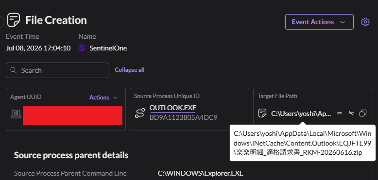
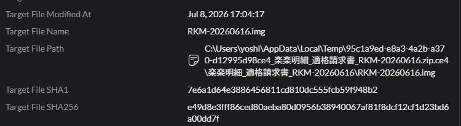
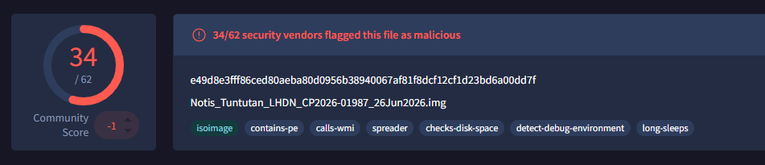
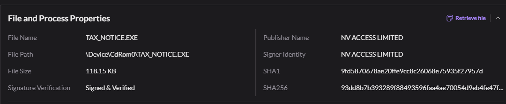
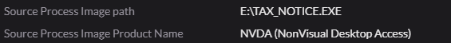
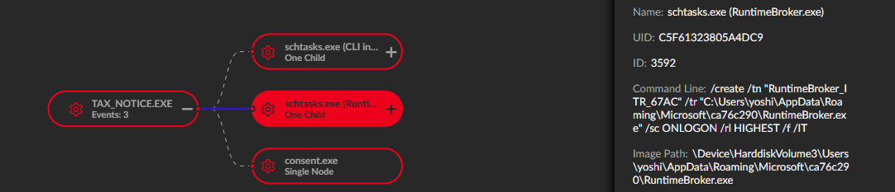
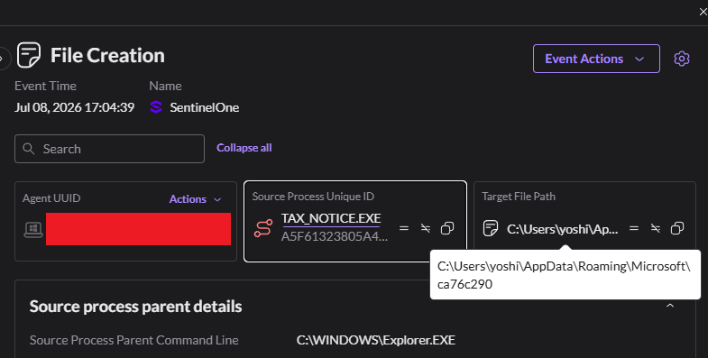
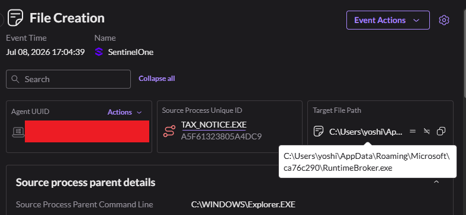
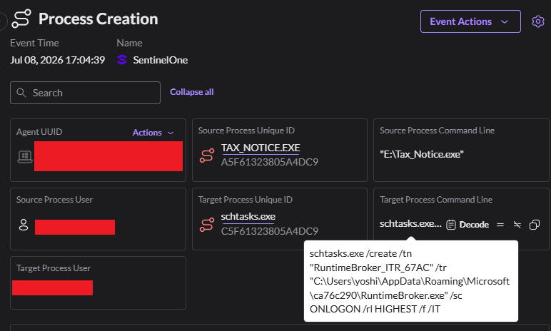
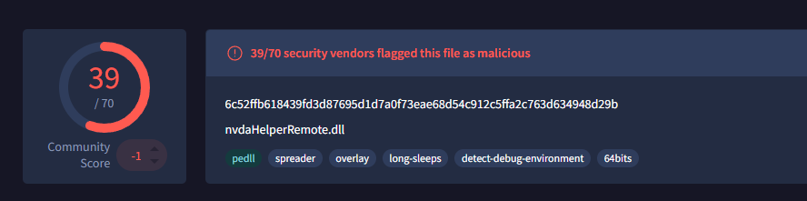

# DLLサイドローディングによるフィッシングログ分析 - 20260714

あるユーザーがzipファイルをダウンロードし、その中身のファイルが画像ファイルとして実行されたというアラートを受け取った。 
保有していたログを確認すると、17:04:10頃にOUTLOOK.EXEから、アラートで検知したものと同じzipファイルのファイル作成が記録されていることがわかった。 
ファイル名からして、このフィッシングの手口は電子請求書/インボイス関連の書類を装おうとしていることがすでに推測できる。以下がそのファイルパスの様子だ: 

`楽楽明細_適格請求書_RKM-20260616.zip` というzipファイルがダウンロードされ、展開すると`RKM-20260626.img`という画像ファイルが現れた。 
おそらくユーザーのファイルエクスプローラーでは拡張子の表示が無効になっており、不自然な拡張子に気づかなかった可能性が高い。 
先に進む前に、念のためこのファイルハッシュをVirusTotalにかけて何が出るか確認しておこう。

ログを遡ると、ダウンロードされたファイルをスキャンしようとsmartscreen.exeが実行された形跡があったが、それでも実行時に悪意あるファイルとして検知することはできなかった。この理由は、このファイルはMOTW(Mark of the Web)が付与されておりSmartScreenの起動自体はトリガーされたものの、SmartScreenはマウントされたドライブの中身までは確認しないためだ。これは組み込みのスキャンを回避する巧妙な手口の一つだ。そして、マウントされたドライブが実行されると、それはローカルディスクとして扱われるため、そこから実行されるものはインターネットからのダウンロードファイル(MOTW)とはみなされなくなる——これによってSmartScreenが再度トリガーされることを回避している。

ユーザーがこの画像ファイルを実行した後、`TAX_NOTICE.EXE`という名前のファイルに関する別のアラートが発生した。ファイルのプロパティを見てすぐに気づいたのは、このファイルパスがドッキングされたCdRom(先ほどの.imgファイル)から来ているという点だ。この時点ですでに大きな危険信号だ。さらに興味深いのは発行元(publisher)の名前で、`NV Access Limited`となっている。軽くGoogle検索してみると、これは視覚障害者向けのオープンソーススクリーンリーダー(NVDA)をWindows向けに開発している団体だとわかった。VirusTotalで確認すると、このファイルハッシュは正式に署名されたものになっている。これは非常に奇妙な話だ——このファイルは「本来」請求書であるはずなのだから。

[Source Process Image Product Nameがイメージ名と一致しない場合のその他のメタデータ]

次にStorylineを見てみよう。ここでは他にも興味深いプロセスが確認できる。`consent.exe`と`schtasks.exe`だ。 
consent.exeはおそらく、このファイルに実行権限——つまり仮想ドライバをシステムにインストールする権限——を与えることをユーザーに確認するポップアップで、プログラム実行前によく表示される一般的なダイアログボックスだ。これもまた一つの危険信号と言える。 
そして、schtasks.exeで使用されたコマンドラインを見ると、さらに興味深いことがわかる。 

ユーザーがログオンするたびに、最高権限でRuntimeBroker.exeを実行するスケジュールタスクが作成されている。 
ここには明らかな危険信号がいくつも見られる。 
1. 作成されているスケジュールタスクの名前が「RuntimeBroker_ITR_67AC」という不自然なものになっている。
2. このタスクはAppData内のランダムなフォルダを参照している。もし本物のWindows runtimebrokerであれば、System32フォルダから来ているはずだ。
3. /sc ONLOGON → ユーザーがログインするたびに起動するよう設定されている。
4. /rl HIGHEST → 最高権限で実行されるよう設定されている。

Storylineレポートからもさらに興味深いことがわかる。 
`nvdaHelperRemote.dll`というファイルの作成が確認できる。そしてその後、`TAX_NOTICE.EXE`が`RuntimeBroker.exe`という名前に変更されているが、両者は同じファイルハッシュを持っている。詳しい情報を得るためにSentinel OneのEvent Searchでこれらを調べてみよう。名前が変更されたTAX_NOTICE.exeについては、スクリーンショットの右側でこのファイルが署名・検証済みであることが確認でき、さらに二つのファイルハッシュはNVDAのファイルであるとされるもののSHA1と一致している。 
ここで何が起きているのか、すでにある程度推測できるが、引き続き調査を進めよう。

次に明らかにする必要があるのは、そのフォルダで何が起きているのかという点だ。

Event Searchで見つけた以下の画像を見ると、まず`AppData\Roaming\Microsoft`内に`ca76c290`というフォルダの作成が確認できる。そこから、RuntimeBroker.exeが作成される。もしこれが本物のruntimebroker.exeであれば、System32フォルダからのみ生成されるはずだ。その後、同じフォルダ内にnvdaHelperRemote.dllが作成される。さらにその後、タスクスケジューラが作成されている。

RuntimeBrokerが実際にはNVDAのファイルであることがわかっているので、作成されたnvdaHelperRemote.dllのファイルハッシュをVirusTotalで確認してみよう。

見ての通り、このファイルは明らかに悪意のあるものだ。つまり、ここで起きていることはMITRE ATT&CKでいうところの「DLLサイドローディング」と呼ばれる手法だ。 
nvdaHelperRemote.dllは確かにNVDAのコアライブラリコンポーネントの一つだが、ここで作成されたdllは偽物だ。本物のNVDAファイル(今回のケースでは自分自身を隠すために名前を変更されたTAX_NOTICE.EXE)が実行される際、その機能の一部としてこのコアライブラリコンポーネントを呼び出す必要がある。しかしこの呼び出しは、実行されたアプリケーションに最も近い場所にあるdllを探す仕組みになっている。Windowsはdllを検索する際、まずアプリケーションのディレクトリを最優先で確認する。つまり、この偽の悪意あるファイルが優先的に読み込まれ、実行されてしまうということだ。これがdllハイジャッキングの仕組みだ。

このdllファイルに含まれるコードが、ユーザーがログインするたびに端末への永続的なアクセスを確保するためにタスクスケジューラをトリガーしたものと考えられる。 
今回のケースでは、Sentinel Oneがこのハイジャッキングを検知し、さらなる被害が及ぶ前にロールバックを実行した。このキャンペーンに関する情報がないかGoogleで調べたところ、Hacker Newsの記事で、中国系のハッカーが偽の税務申告ツールを使ってDcRATを展開しているという内容を見つけた。 
`https://thehackernews.com/2026/07/suspected-china-nexus-hackers-use-fake.html`

その記事によると、セキュリティ企業のLevelBlueは、中国語話者と日本語話者を標的とした、ValleyRatというマルウェアを配布する偽インストーラーを使った2つの異なるキャンペーンを検知したとしている。このファイルもおそらく同じキャンペーンに関連するものだろう。