# インフォスティーラー: Flare & QRadar ログ調査 - 20260807

※この調査は2026/08/09また2026/08/16に、元の調査内容の下に追記という形で更新されています。ネタバレ:元のダウンロード元が判明しました。

この調査についての簡単な背景を説明します。あるデバイスがインフォスティーラー(情報窃取型)マルウェアに感染していました。この件を知ったきっかけは、盗まれたデータがダークウェブ上で見つかったことです(Flareのおかげで確認できました)。<br>
今回の調査はかなり長丁場でしたが、手持ちの情報だけでどこまでやれるか試してみたので、その過程をきちんと記録しておく価値があると思いました。FlareとQRadarのネットワークログを使って、深く掘り下げることができたので。<br>

では最初から説明していきます。<br>
あるユーザーの個人情報がダークウェブに流出しているという報告を受けました。フォレンジック部門が感染したデバイスを回収し、対応にあたっていましたが、SOCチームには、そのネットワーク上の特定URLに関する不審な通信を調べるよう依頼がありました。<br>
その依頼をきっかけに、この事案に強く興味を惹かれ、自分でも独自に調査を進めることにしました。

※:この調査は自主的に行ったものなので、フォレンジック部門から追加情報の共有は受けておらず、使えるのはFlareアカウントとQRadarのネットワークログのみでした。<br>
その結果を以下にまとめます。

## 調査内容

まずはFlareの画面がどんなものか見てみましょう。<br>
グローバル検索バーから、`features.domain:`を指定して、対象ユーザーの業務用メールアドレスのドメインを検索しました。

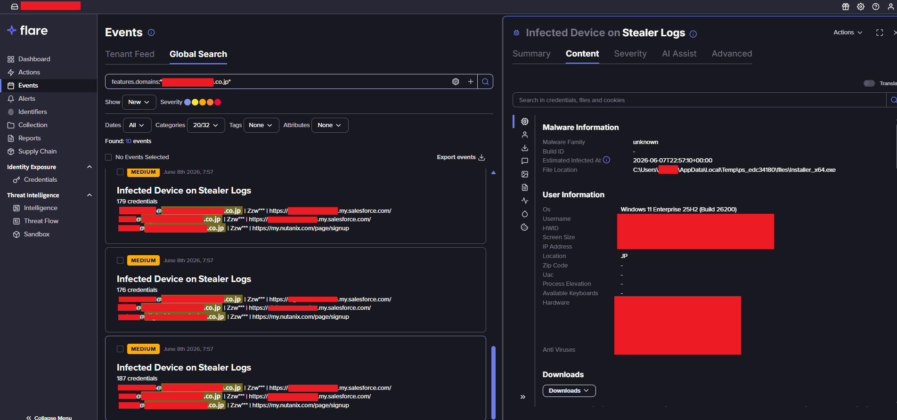

上の画像の左側を見ると、このドメインが数多くのスティーラーログの中で見つかっていることが分かります。Salesforceのログイン認証情報まで見つかっています。かなりまずい状況です。<br>
右側には、盗まれたデータの内容がすべて表示されています。当然ですが、こちらはモザイク処理をしています。<br>
一番上には感染推定日と、マルウェアのファイルパスが記載されています。このログは6月に流出したもののようだったので、まずはこの月に絞って調べることにしました。残念ながら、ファイル名は`Installer_x64.exe`という汎用的な名前だったため、ハッシュ値なしでは具体的にどのファイルなのか特定するのは難しそうでした。でもそれは仕方ない、手持ちの材料でやっていきましょう。右側の列は長いので、下にスクロールすると感染したユーザーについてさらに情報が出てきます。

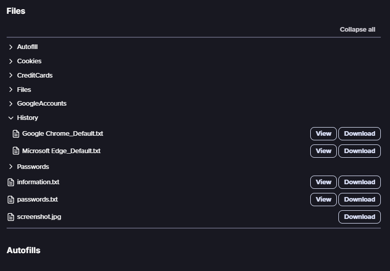

少しスクロールすると、盗まれたものすべてのファイルがあることに気づきました。その中でも2つ、目を引くものがありました。「Files」と「History」です。<br>
「Files」には、感染当時PCに入っていたソフトウェアやその他のファイルが含まれていました(見た限り、記載されているソフトウェアの.pngと.txtファイルのみが保存されているようでした)。一方「History」には、ユーザーのインターネット検索履歴のログが入っていました。ChromeとEdge両方のファイルを開いてみましたが、Chromeはログがかなり少なかったので、Edgeの履歴の方に注目することにしました。

この時点で、私が特に知りたかったのは、デバイスがどうやって感染したのか、その原因は何だったのかということです。<br>
そこで.exeファイルを検索してみました。すると、非常に興味深いものが見つかりました。

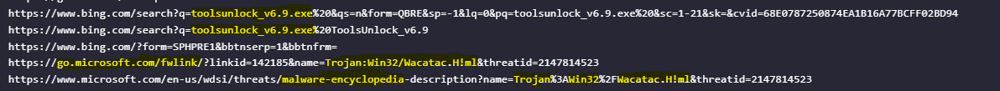

ご覧の通り、ハイライトされているのは「Tools Unlock v6.9」というソフトウェアです。<br>
その真下には、トロイの木馬に関連するマイクロソフトのリンクがあります。これは明らかに悪意を感じさせます。<br>
`go.microsoft.com/fwlink`もハイライトしています。というのも、これはリダイレクト(転送)リンクだからです。もしかしたら「詳細情報」というMicrosoft Defenderのポップアップに関連しているのではないかという勘がありました。<br>
そこで、このソフトウェアについて一般的に何か分かることがないか調べてみました。Googleで検索し、SHA256ハッシュがどこかに記録されていないか確認しました。ハッシュ値が見つかったので、それをVirusTotalで検索しました。その結果が以下です。

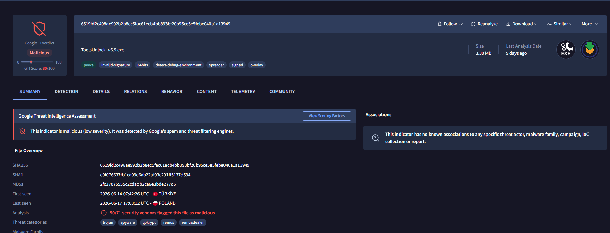

71ベンダー中50ベンダーがこのファイルを悪意あるものとしてフラグを立てています。

Contacted IP addressesのセクションまでスクロールすると、1つのIPが赤字になっていることに気づきました。詳しく見てみると、それはTelegramのIPとしてリストされていました。TelegramはC2通信によく使われるため、これは大きな危険信号でした。そこで、自分のログでも6月中に同じTelegramのIPアドレスがないか調べてみました。すると、案の定見つかりました。2つの異なるローカルIPに、2つの異なる日にちで接続していたのです。ここで、最も早い日付とそのローカルIPに注目することにしました。6月16日です。

※:Flareのログには16日と一致する日付はありませんでした。最も早い感染/投稿日は8日で、それ以降の日付はすべて7月中旬~下旬に集中していました。そのため、この時点では16日のみにTelegramのIPが現れたことから、8日のネットワークログは見ていませんでした。デバイス上で別の感染があった可能性も十分ありますし、単にFlareの推定日が正確でなかった可能性もあります。

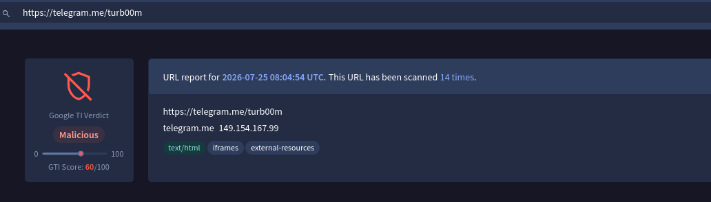
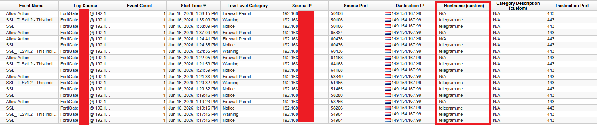

この発見を上司に報告し、マルウェアの発生源だと疑われるファイル名も併せて伝えました。<br>
ただ正直なところ、これだけではまだ納得できませんでした。ファイル自体に興味が湧いたので、VirusTotalからダウンロードしてみました。そこから、プライベートスキャンとして再アップロードし、pcapで何が明らかになるか確認しました。<br>
`@turb00m`というプロフィールへのGETリクエストを含むTelegramのパケットが見つかり、その後text/htmlのパケットにも気づきました。そのtext/htmlパケットをさらに調べると、Steam CommunityプロフィールへのURLが見つかりました。ページを確認してみましたが、非公開に設定されていました。ユーザー名`76561198689449626`が単なる数字の羅列だったことも不審で、おそらくAPIコールではないかと思いましたが、実際にプロフィールに何が書かれていたかは確認できませんでした。プロフィールの詳細欄やコメント欄にリンクやペイロードが仕込まれていた可能性はありますが、これはあくまで推測にすぎません。<br>
以下の画像は、非公開プロフィールと、確認できた公開情報の両方です。プロフィールの詳細を見ると、作成されたのはつい最近(6月12日)で、最後に公開状態だったのは(このスクリーンショットの時点で)7月11日でした。また6月24日には名前も変更されていました。コミュニティURLはpcapにあったものと一致しています。

もし悪意あるファイルがTools UnlockだけでC2に接続するものだったなら、なぜSteamの通信があるのでしょうか?<br>
そこで、VirusTotal上の公開pcapに何か違いがないか気になり、確認してみました。すると、実際に違いがありました。

[プライベートスキャンpcap]<br>
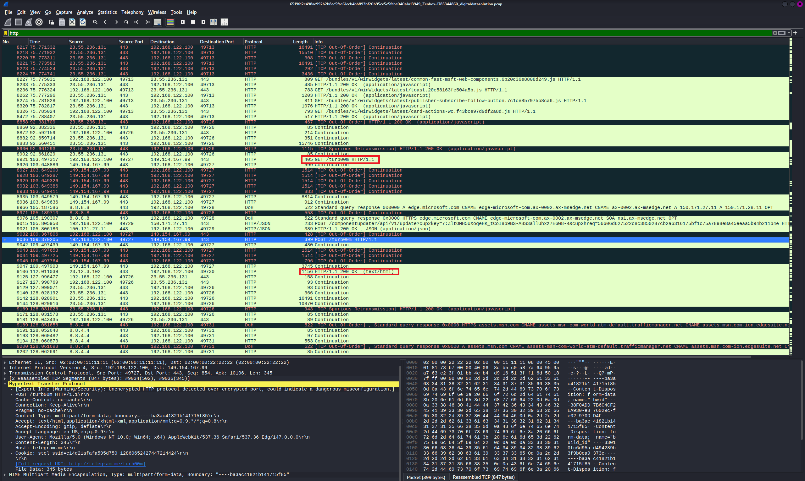

[公開pcap]<br>
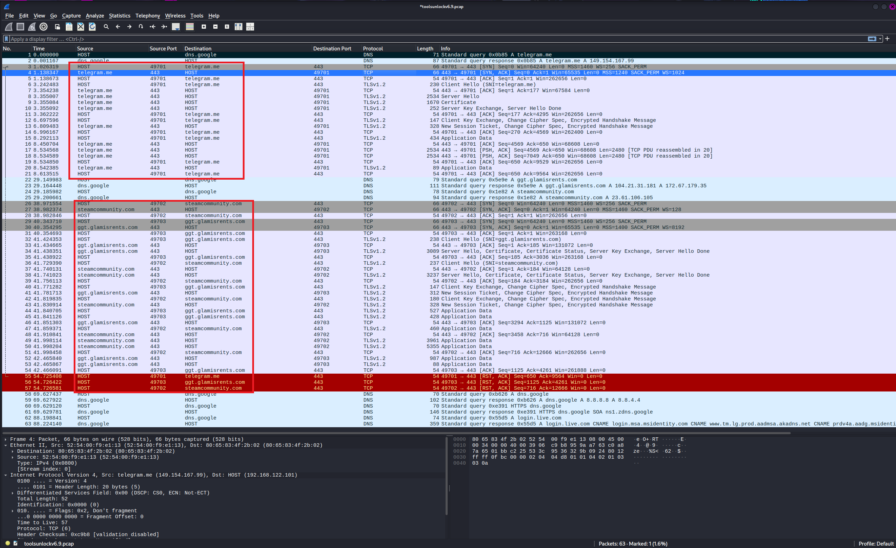

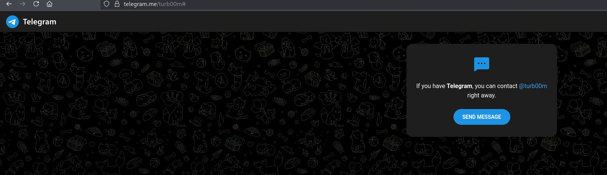
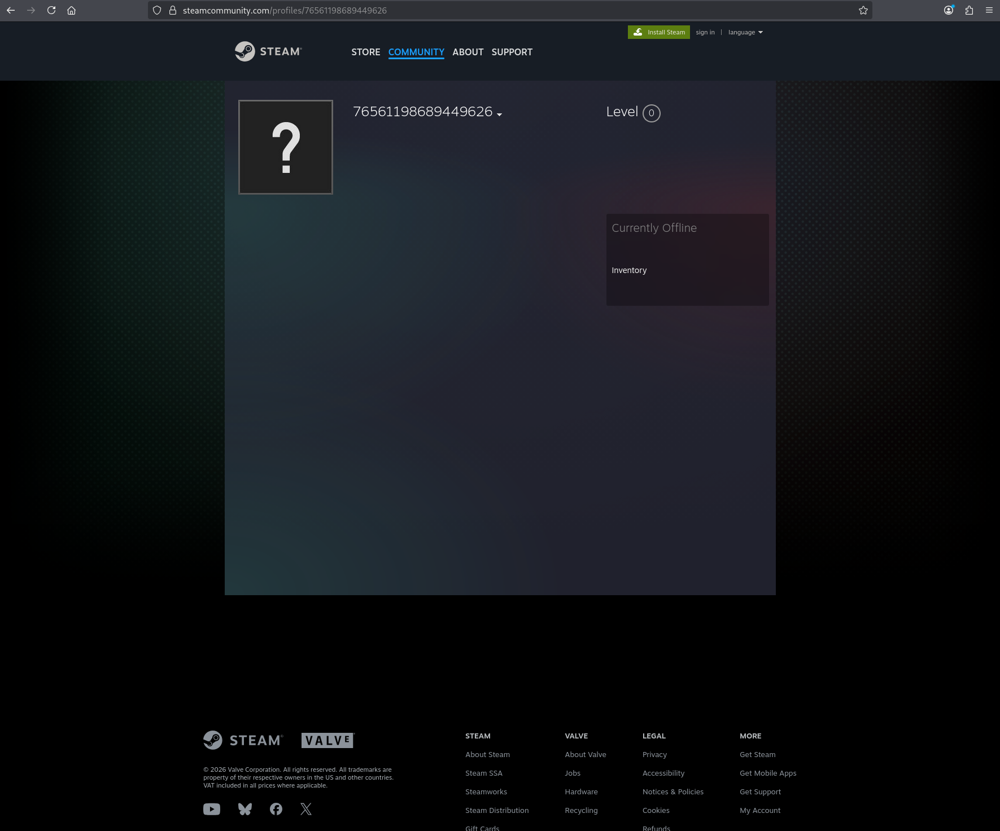
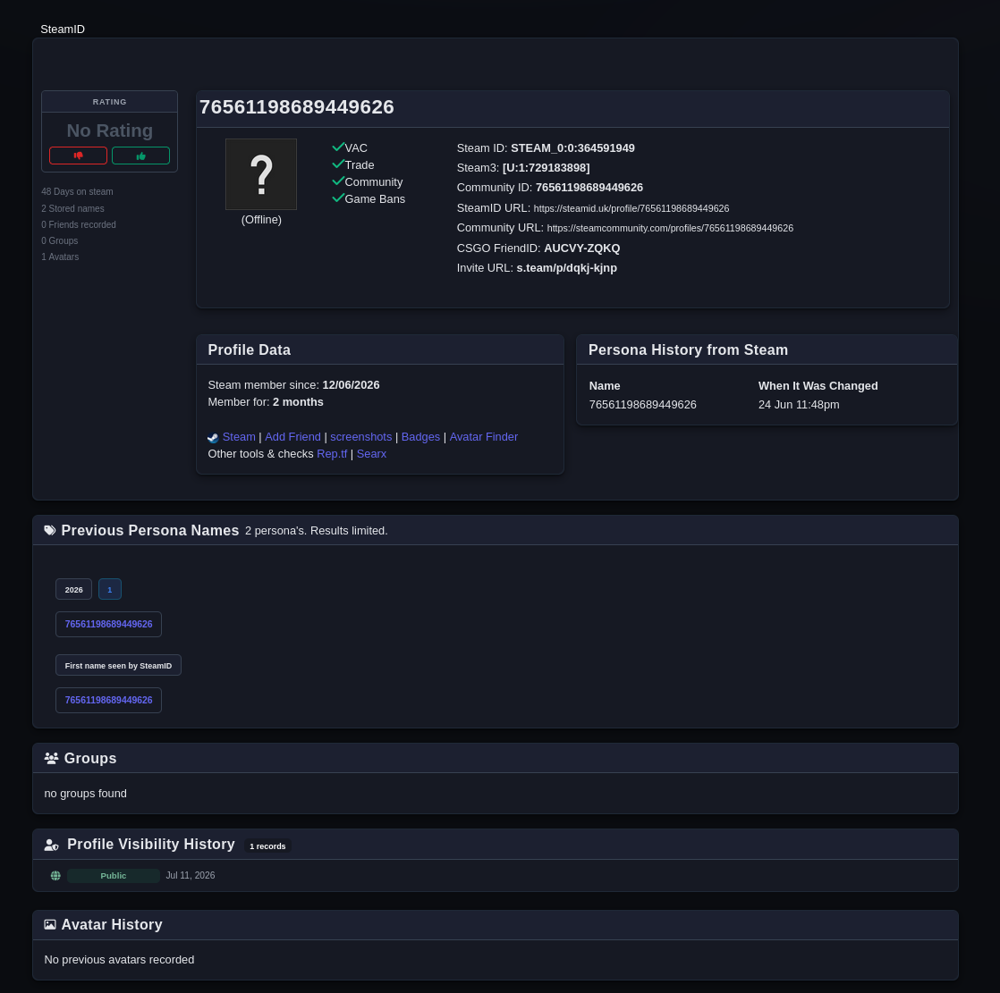

パブリックpcapには、Steamプロフィールと通信しているように見える不審なURLがありました。そしてわずか数秒後、3つの接続すべてが突然切断されていました。<br>
Steamプロフィールが正確にどんな役割を果たしていたのかは不明ですが(おそらくコメント欄にその不審なサイトへ接続するためのリンクかペイロードが仕込まれていたのではないか)、これが単なる偶然でないことは間違いありませんでした。<br>
Telegram通信の存在が確認できた(同一IPアドレス)ので、自分の手元にあるネットワークログでも同じような挙動が見られないか気になりました。QRadarの検索条件を、Telegram通信が見つかったデバイスのローカルIPに絞り込み、時間帯をTelegram通信が発生していた1:15~1:45に設定し、ペイロードに「steam」という単語を含むものを検索しました。そして見事、Steam Community宛の通信が見つかりました!

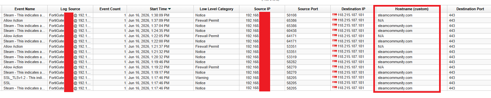

Steam通信が確認できたなら、次はファイアウォールにヒットしている何か不審なウェブサイトがあるはずですよね?<br>
というわけで、次の目標は不審なウェブ通信を見つけることでした。これがなかなか大変な作業でした。最初は不審なIPの所在地に注目していたのですが、これは実りがありませんでした。そこで、一部のIPにはフラグや所在地の情報が表示されていないことに気づきました。1つを詳しく見てみると、ブロックされていることが分かりました。

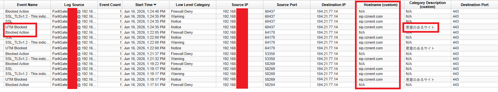

このブロックされたサイトは、何度もファイアウォールを突破しようと試みていました。ドメイン名自体もかなり不審で、`sip.rzrrent[.]com`。カテゴリの説明も「悪意のあるサイト」となっていました。<br>
ただ、もしこのPCから実際にデータが盗まれたのであれば、このサイトはブロックされていたわけですから、他に実際に突破できたサイトがあったはずです。<br>
そこで、所在地/フラグ情報のない他のIPをさらに探しました。すると、あるサイトが見つかりました。`en.taiwebs[.]com`です。名前だけでは確実に不審だとは言い切れませんでした(調べてみると、このサイトはかつて違法ソフトウェアのダウンロード先として使われていたようです)。カテゴリの説明も「違法・非論理的」となっていましたが、念のためurlscan.ioにかけてみました。すると……サーバーがダウンしていました!

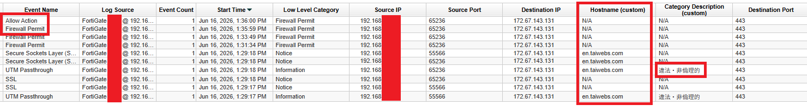
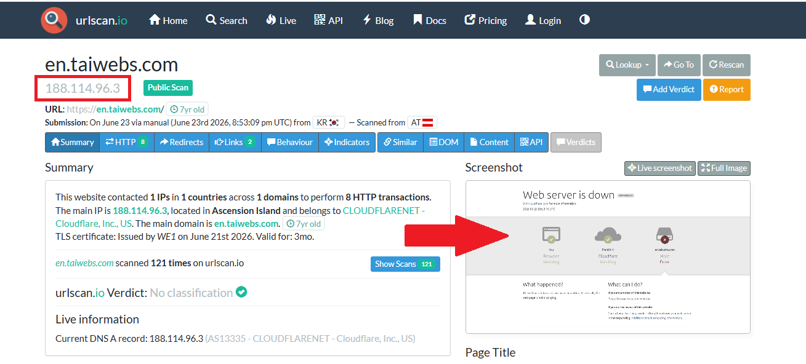

それは……妙な話です。でも、もう1つ気になる点がありました。urlscan.io上で、サイト名の下に表示されていたIPアドレスが、ネットワークログに記載されていたIPアドレスと違っていたのです。今度はそのIPアドレスを検索してみたところ、過去2週間のうちにそのIPで使われていたドメイン名の長いリストが出てきました。間違いなく悪意あるものです。ついでに、ブロックされていたIPアドレスも同様に調べてみました。こちらも同じで、使い回されている非常に悪質そうなドメインの長いリストが出てきました。

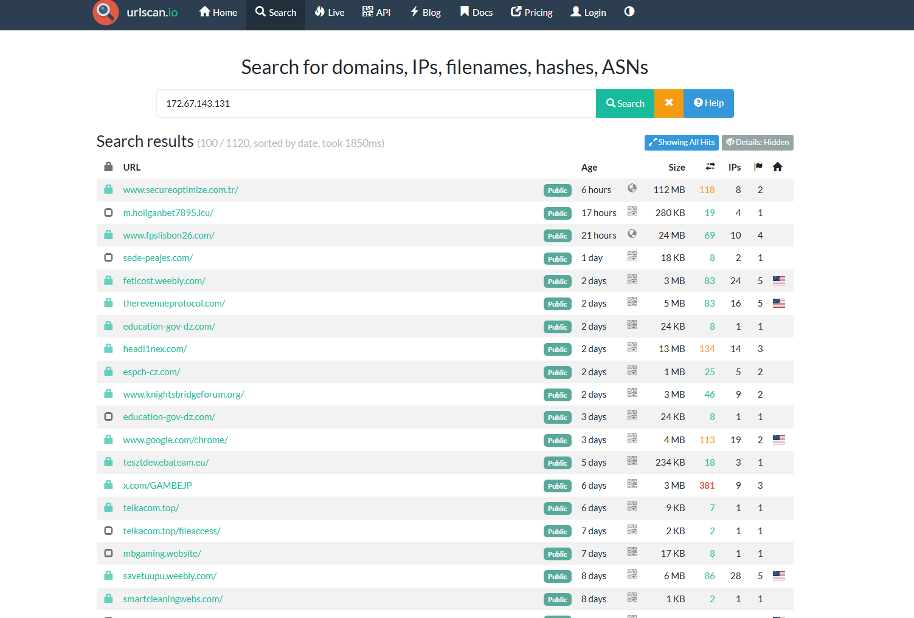
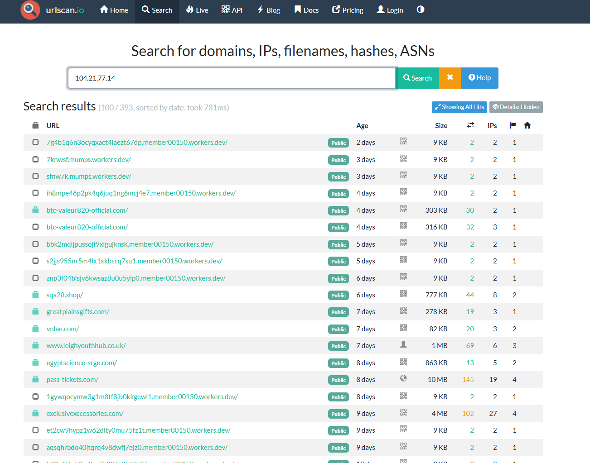

これで確定です。パブリックpcapと同様に、自分たちのログにも不審なサイト通信が記録されていました。<br>
残念ながら、調査対象のネットワークについてはpcapを持っていなかったため、パケットの中身までは特定できませんでした。ペイロードがどんな内容だったのか、何が送受信されていたのかは分かりません。ただ念のため、ログをもう少しだけ、数分間分見てみたところ、最後にもう1つ不審な通信が見つかりました。ロシアのIPアドレスです。

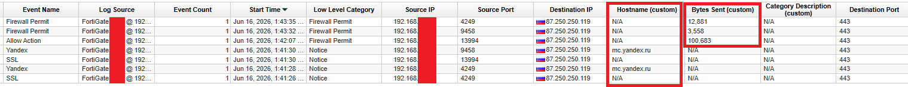

送信バイト数を見ても、これが盗まれたデータの送信に使われたものかどうかは断定しづらいところです(そもそも盗まれたデータ量自体がそれほど多くなかったので、可能性がないわけではありません)。しかし、そもそもこのユーザーがこのサイトにアクセスする必要性は全くなく、しかも事案発生とほぼ同じタイミングで発生していたので、報告する価値はあると考えました。

では、タイムラインを見てみましょう。<br>

<pre style="background:none; border:none; padding:0; font-family:monospace; line-height:1.2;"> 
6/16<br>
│   ├── 1:17:45 Telegram(@turb00m)との最初の通信<br>
│       ├── 1:17:46 Steam(76561198689449626)との最初の通信<br>
│           ├── 1:17:51 遮断サイト(sip.rzrent)との最初の通信<br>
│           └── 1:24:40 遮断サイトとの最後の通信<br>
│           ├── 1:29:17 突破されたサイト(en.taiwebs)との最初の通信<br>
│           └── 1:36:00 突破されたサイトとの最後の通信<br>
│       └── 1:38:09 Steamとの最後の通信<br>
│   └── 1:38:15 Telegramとの最後の通信<br>
│       ├── 1:41:26 ロシアIP(yandex)との最初の通信<br>
│       └── 1:43:35 ロシアIPとの最後の通信<br>
</pre>

合計で、実際の攻撃時間はおよそ20分でした(ロシアIPへの通信を除く)。もし最初のブロックされたサイトへの接続が成功していたら、もっと短時間で済んでいたはずです。ただこれは同時に、攻撃者がおそらく攻撃手法を手動で調整し、突破する必要があったことも示しています。ブロックから成功まで約5分の間隔があったことから、自動化された攻撃ではなかったと思われます。

この発見を報告し、これで一件落着だと思っていました。<br>
しかし、最後にちょっとググっていたところ、追加の情報を教えてくれるXの投稿を見つけました。

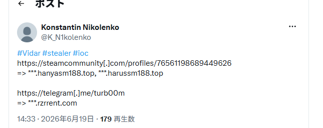

Steam Communityのプロフィールは同一のものです。<br>
Telegramのアカウントも同一のものです。<br>
そして最初にブロックされたサイトも、全く同じものです。<br>
今回調べたインフォスティーラーは、どうやら`Vidar Stealer`のようです。

Vidar Stealerは2018年に登場した比較的古いタイプのインフォスティーラーですが、Vidar 2.0として改良されているようです。<br>
その挙動について分かりやすく解説しているブログを見つけました。今回の調査で経験したのと同じ種類の通信についても触れられていたので、これはほぼ間違いなく一致していると思います。<br>
`https://www.picussecurity.com/resource/blog/vidar-malware-how-the-multithreaded-windows-stealer-works`

こうして、ダークウェブ上の流出データの発見から、本格的なネットワーク調査へとつながっていきました。この調査は個人的にとても楽しめました。まさにパズルのピースを必死に集めて、それらが論理的にどうつながるのかを解き明かしていくような感覚で、事案の全容や経緯が目の前で徐々に明らかになっていく様子を見るのは本当に面白かったです。

## 更新 2026/08/09

嬉しい知らせです、フォレンジックチームが感染したデバイスについての簡単な調査報告を共有してくれました。<br>
彼らもまた、感染の根本原因がToolsUnlock.exeファイルであるという結論に至っていました。調査の過程で、ユーザーのDownloadsフォルダ内に`6/16 13:16:15`に作成された`Get_Link.txt`というファイルが見つかったそうです。<br>
このファイルの中には、ToolsUnlock.zipへのDropboxリンクと、解凍用のパスワードが記載されていました。以下の通りです:
```
hxxp[:]//www.dropbox[.]com/scl/fl/hskmvo1wjh2sgkoagdcvq/ToolsUnlock.zip?rlkey=vz3y5ii3i8yh606rpsrbjc88d&st=v13baa5c&dl=1
Password: w8zt3a
```

こうして、ToolsUnlockファイルがどこからダウンロードされたのかは特定できましたが、その一方で、この「Get_Link.txt」ファイル自体がどこから来たのかは分からなかったとのことでした。そして、そこで調査は終わっていました。<br>
でも、Downloadsフォルダに入っているということは、その.txtファイルがどこかからダウンロードされたはずです。気になってしまいました。そこでもう一度Flareでこのユーザーの検索履歴を確認しようとしたのですが……フォレンジックチーム(管理者アカウントを持つ側)が、SOCチームのゲストアカウント権限を剥奪していて、詳細を見られなくなっていました。最悪、行き詰まりです。

……と、思っていました。

私はどうしてもこの謎のファイルを見つけたかったので、もう一度ネットワークログとにらめっこすることにしました。まずDropbox関連の通信がないか検索してみました。すると見つかりました。受信バイト数を見ても、明らかに何かがダウンロードされていることが分かります。これはToolsUnlock.exeに違いありません。

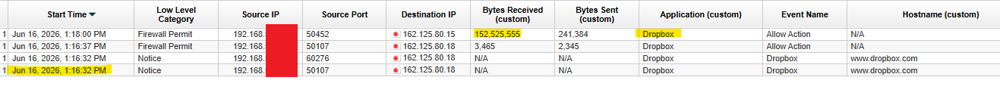

よし、Dropboxの通信は確認できました。でも、ユーザーはこのリンクをどこで手に入れたのでしょうか?<br>
フォレンジックチームがファイル作成時刻として報告していた時間に注目してみました。すると……手がかりになりそうなものが見つかりました。<br>

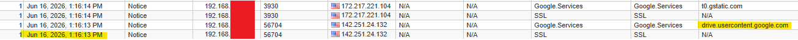

`drive.usercontent.google.com`宛のログがありました。つまり、Google Driveから何かがダウンロードされていたということです。しかもタイミングがフォレンジックチームの報告内容とぴったり一致していたことから、これが決定的な証拠に違いないと確信しました。ただ1つ問題があって……このログにはホスト名しか記録されていませんでした。ペイロードには完全なダウンロードリンクが含まれていなかったのです。分かったのは、Driveから何かがダウンロードされたということだけで、このDriveのダウンロードがどこから来たのかは全く分かりませんでした。また行き詰まってしまいました。

でも、私はしつこい性格です。<br>
どうしてもそのDriveリンクを見つけたかったので、あらゆる方法を試した末に、最終的にDropboxのフォルダ名`hskmvo1wjh2sgkoagdcvq`をGoogleで検索してみることにしました。すると検索結果にMalware Bazaarのリンクが表示されました。クリックしてみることにしました。一番下までスクロールすると、あるコメントに気づきました……

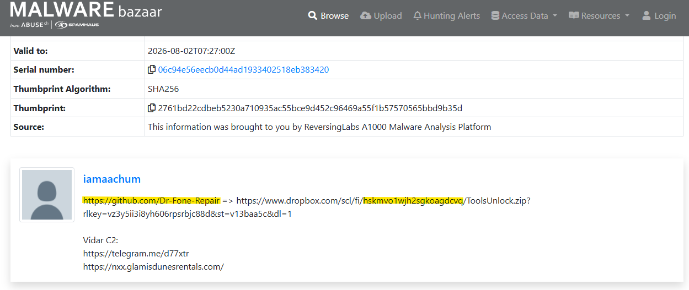

ビンゴ!<br>
同じフォルダ名で、Telegramも呼び出していて、しかも悪意あるウェブサイト(パブリックpcapで見覚えのあるもの)まで登場していました!<br>
そして一番冒頭には、「Dr.Fone Repair」というGitHubリンクがありました。<br>
というわけで、そのGitHubを覗いてみることにしました。

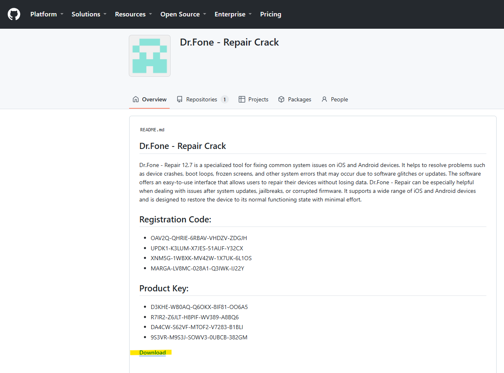

見た目は普通のgitリポジトリのようでした。あちこちクリックして回りました。投稿されたのは2025年でした。<br>
そして……「Download」というリンクにカーソルを合わせてみたところ……

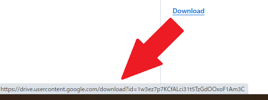

見つけました!!!<br>
`drive.usercontent`リンクでした!興奮しました。クリックしてダウンロードしてみました。<br>
ダウンロードされたのは「Resource_Link.txt」という.txtファイルでした。そして開いてみると……<br>
またしても、ToolsUnlock.exeへのDropboxリンクと、その下にパスワードが!!!<br>
基本的に、フォレンジックチームが発見したのと全く同じファイルでした!!!

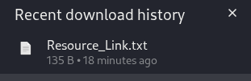<br>
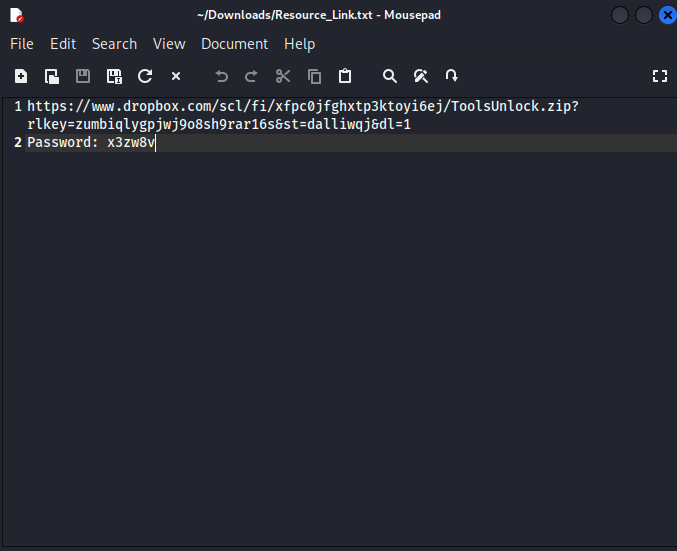

というわけで、これで判明しました!<br>
このユーザーはもともとDr.Fone Repairのクラック版をダウンロードしようとしていたのですが、ダウンロード元だったGitHubリポジトリは偽物で、訪問者をToolsUnlockマルウェアのダウンロードへと誘導するために作られたものだったのです!<br>

## 更新 2026/08/16

さらに嬉しい知らせです。再びFlareのログにアクセスできるようになったので、最後にもう一度Dr.Fone関連のGitHubリンクがどこかにないか確認してみました。結果は、見つかりませんでした。

でも!代わりに、別のGitHubリンクを見つけました。DMDEソフトウェアのクラック版へのリンクです。こちらもクラック版だったので、偽Dr.Foneリポジトリと似たような作りになっていないか確認しに、リンク先を見に行きました。

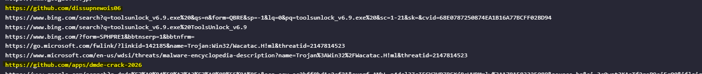
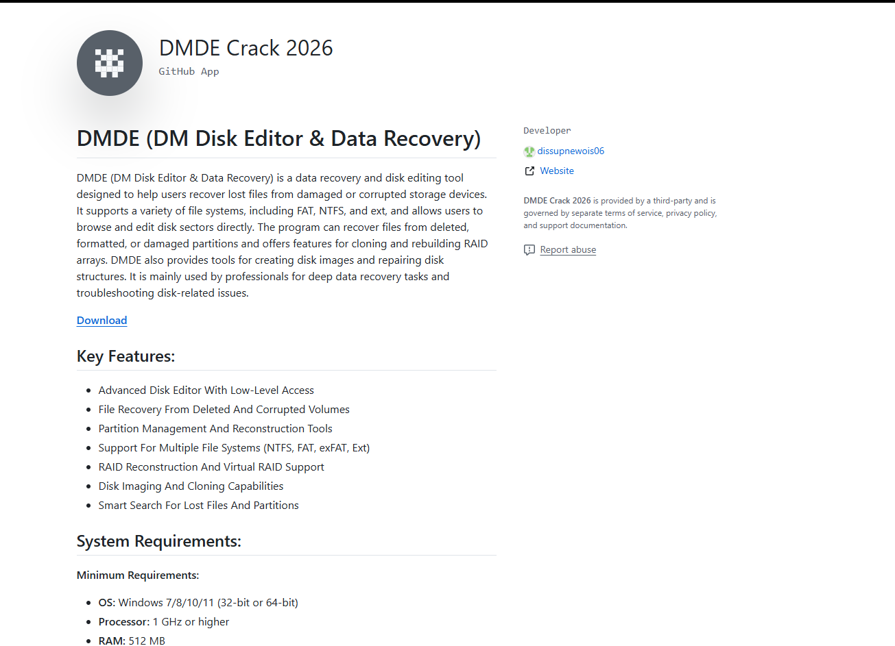

DMDEのGitHubは、Dr.Foneのリポジトリと恐ろしいほどそっくりでした。ダウンロードリンクまで含まれていました。<br>
そこでそのリンクにカーソルを合わせ、ダウンロードしてみると、またしても出てきました!ToolsUnlockへのDropboxリンクです!!

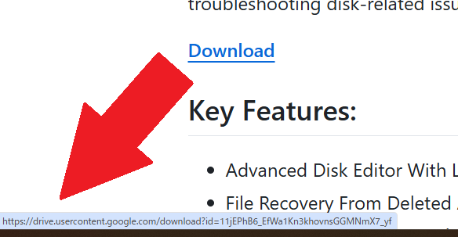<br>
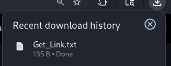<br>
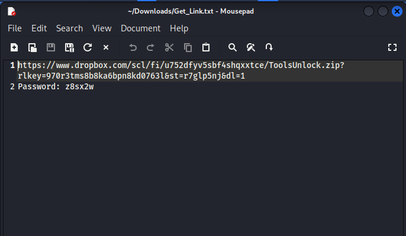

つまり、ToolsUnlockが実際にダウンロードされた本当の悪意あるサイトは、Dr.FoneではなくDMDE CrackのGitHubだったということです。<br>
ただ、最初にDr.Foneとのつながりを見つけていたからこそ、これらの手がかりをつなぎ合わせることができました。<br>
謎は解けました!!


## おまけの調査 (更新前)

ただの興味本位で(あわよくば何か新しいことを学べたらという淡い期待も込めて)、悪意あるファイル(ToolsUnlock_v6.9)自体も調べてみました。<br>
まず、Detect It Easyでこの.exeファイルを解析しました。<br>

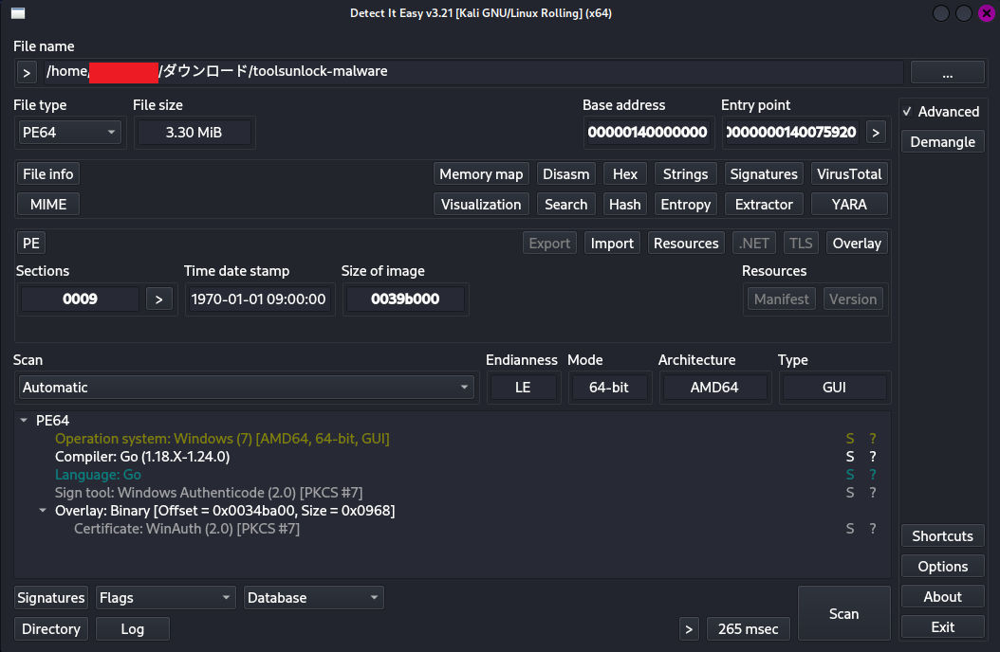
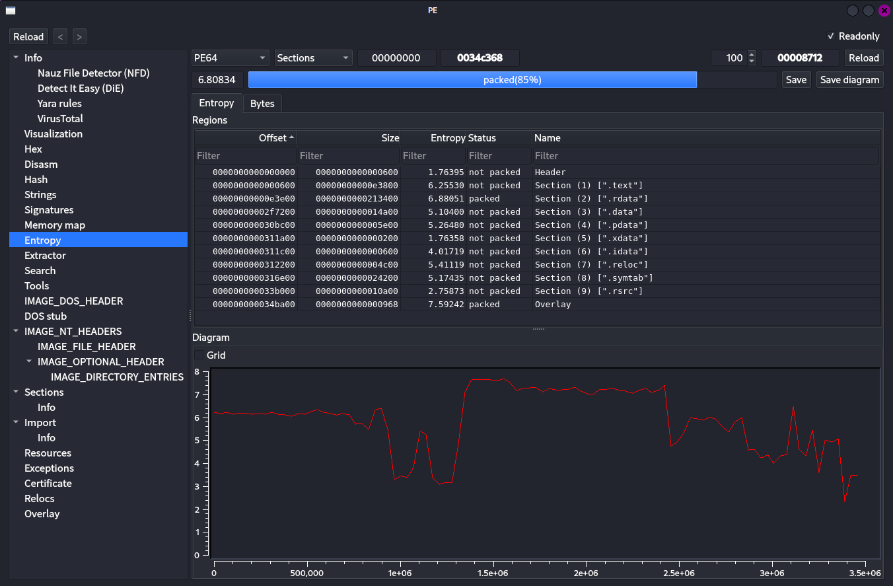

このファイルは64ビットの実行ファイルで、サイズは3.3バイトとなっており、Go言語で書かれているようです。<br>
エントロピーもそれなりに高く、全体の85%がパックされており、特にSection 2(.rdata)は約6.9というエントロピーでパックされていました。どのパッカーが使われたかまでは分かりませんでした。おそらく、実際に悪質なマルウェアコードはこのセクション内にパック・難読化された状態で格納されていると思われます。

その後、Ghidraでこのファイルを解析し、どのような関数/DLLが呼び出されているか、また何か目立つ文字列がないか確認してみました。<br>
すぐに、文字化けした名前の主要な関数が数多くあることに気づきました。

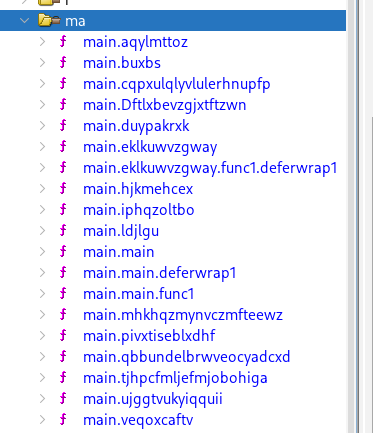

というわけで、以上になります!<br>
読んでいただきありがとうございました!